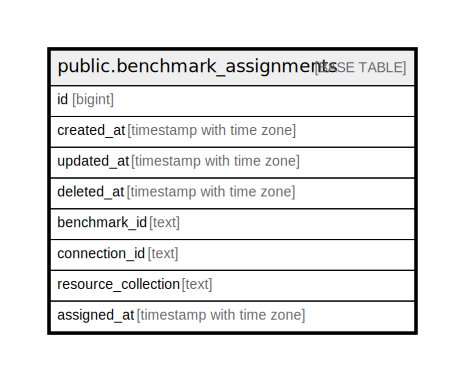

# public.benchmark_assignments

## Description

## Columns

| Name | Type | Default | Nullable | Children | Parents | Comment |
| ---- | ---- | ------- | -------- | -------- | ------- | ------- |
| id | bigint | nextval('benchmark_assignments_id_seq'::regclass) | false |  |  |  |
| created_at | timestamp with time zone |  | true |  |  |  |
| updated_at | timestamp with time zone |  | true |  |  |  |
| deleted_at | timestamp with time zone |  | true |  |  |  |
| benchmark_id | text |  | false |  |  |  |
| connection_id | text |  | true |  |  |  |
| resource_collection | text |  | true |  |  |  |
| assigned_at | timestamp with time zone |  | true |  |  |  |

## Constraints

| Name | Type | Definition |
| ---- | ---- | ---------- |
| benchmark_assignments_pkey | PRIMARY KEY | PRIMARY KEY (id) |

## Indexes

| Name | Definition |
| ---- | ---------- |
| benchmark_assignments_pkey | CREATE UNIQUE INDEX benchmark_assignments_pkey ON public.benchmark_assignments USING btree (id) |
| idx_benchmark_assignments_deleted_at | CREATE INDEX idx_benchmark_assignments_deleted_at ON public.benchmark_assignments USING btree (deleted_at) |
| idx_benchmark_rc | CREATE INDEX idx_benchmark_rc ON public.benchmark_assignments USING btree (benchmark_id, resource_collection) |
| idx_benchmark_source | CREATE INDEX idx_benchmark_source ON public.benchmark_assignments USING btree (benchmark_id, connection_id) |

## Relations

---

> Generated by [tbls](https://github.com/k1LoW/tbls)
