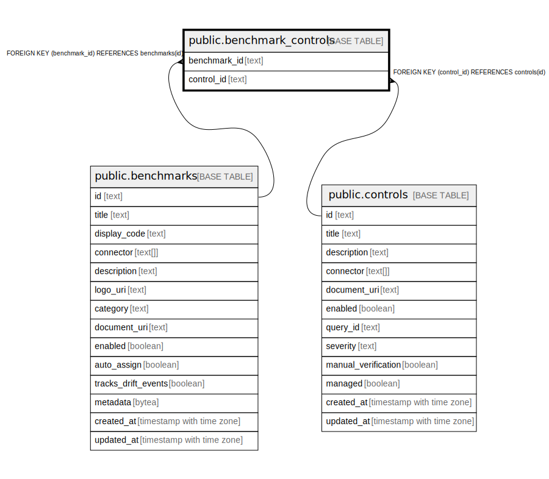

# public.benchmark_controls

## Description

## Columns

| Name | Type | Default | Nullable | Children | Parents | Comment |
| ---- | ---- | ------- | -------- | -------- | ------- | ------- |
| benchmark_id | text |  | false |  | [public.benchmarks](public.benchmarks.md) |  |
| control_id | text |  | false |  | [public.controls](public.controls.md) |  |

## Constraints

| Name | Type | Definition |
| ---- | ---- | ---------- |
| fk_benchmark_controls_control | FOREIGN KEY | FOREIGN KEY (control_id) REFERENCES controls(id) |
| fk_benchmark_controls_benchmark | FOREIGN KEY | FOREIGN KEY (benchmark_id) REFERENCES benchmarks(id) |
| benchmark_controls_pkey | PRIMARY KEY | PRIMARY KEY (benchmark_id, control_id) |

## Indexes

| Name | Definition |
| ---- | ---------- |
| benchmark_controls_pkey | CREATE UNIQUE INDEX benchmark_controls_pkey ON public.benchmark_controls USING btree (benchmark_id, control_id) |

## Relations

---

> Generated by [tbls](https://github.com/k1LoW/tbls)
