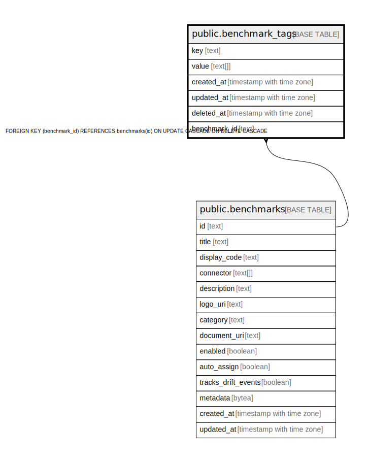

# public.benchmark_tags

## Description

## Columns

| Name | Type | Default | Nullable | Children | Parents | Comment |
| ---- | ---- | ------- | -------- | -------- | ------- | ------- |
| key | text |  | false |  |  |  |
| value | text[] |  | true |  |  |  |
| created_at | timestamp with time zone |  | true |  |  |  |
| updated_at | timestamp with time zone |  | true |  |  |  |
| deleted_at | timestamp with time zone |  | true |  |  |  |
| benchmark_id | text |  | false |  | [public.benchmarks](public.benchmarks.md) |  |

## Constraints

| Name | Type | Definition |
| ---- | ---- | ---------- |
| fk_benchmarks_tags | FOREIGN KEY | FOREIGN KEY (benchmark_id) REFERENCES benchmarks(id) ON UPDATE CASCADE ON DELETE CASCADE |
| benchmark_tags_pkey | PRIMARY KEY | PRIMARY KEY (key, benchmark_id) |

## Indexes

| Name | Definition |
| ---- | ---------- |
| benchmark_tags_pkey | CREATE UNIQUE INDEX benchmark_tags_pkey ON public.benchmark_tags USING btree (key, benchmark_id) |
| idx_benchmark_tags_deleted_at | CREATE INDEX idx_benchmark_tags_deleted_at ON public.benchmark_tags USING btree (deleted_at) |

## Relations

---

> Generated by [tbls](https://github.com/k1LoW/tbls)
