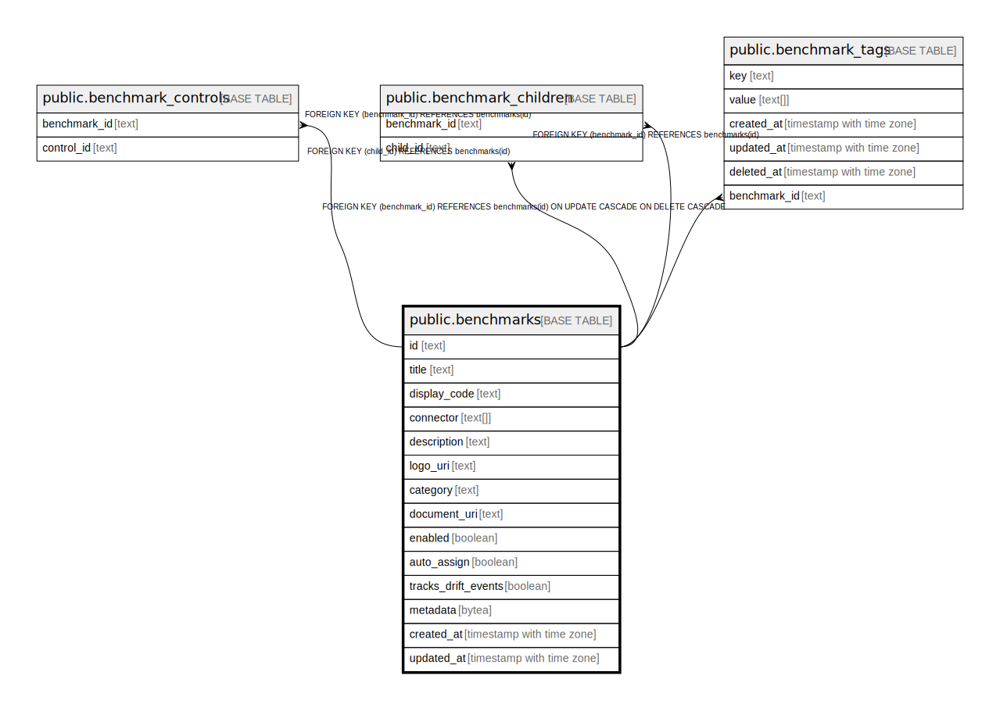

# public.benchmarks

## Description

## Columns

| Name | Type | Default | Nullable | Children | Parents | Comment |
| ---- | ---- | ------- | -------- | -------- | ------- | ------- |
| id | text |  | false | [public.benchmark_controls](public.benchmark_controls.md) [public.benchmark_children](public.benchmark_children.md) [public.benchmark_tags](public.benchmark_tags.md) |  |  |
| title | text |  | true |  |  |  |
| display_code | text |  | true |  |  |  |
| connector | text[] |  | true |  |  |  |
| description | text |  | true |  |  |  |
| logo_uri | text |  | true |  |  |  |
| category | text |  | true |  |  |  |
| document_uri | text |  | true |  |  |  |
| enabled | boolean |  | true |  |  |  |
| auto_assign | boolean |  | true |  |  |  |
| tracks_drift_events | boolean |  | true |  |  |  |
| metadata | bytea |  | true |  |  |  |
| created_at | timestamp with time zone |  | true |  |  |  |
| updated_at | timestamp with time zone |  | true |  |  |  |

## Constraints

| Name | Type | Definition |
| ---- | ---- | ---------- |
| benchmarks_pkey | PRIMARY KEY | PRIMARY KEY (id) |

## Indexes

| Name | Definition |
| ---- | ---------- |
| benchmarks_pkey | CREATE UNIQUE INDEX benchmarks_pkey ON public.benchmarks USING btree (id) |

## Relations

---

> Generated by [tbls](https://github.com/k1LoW/tbls)
