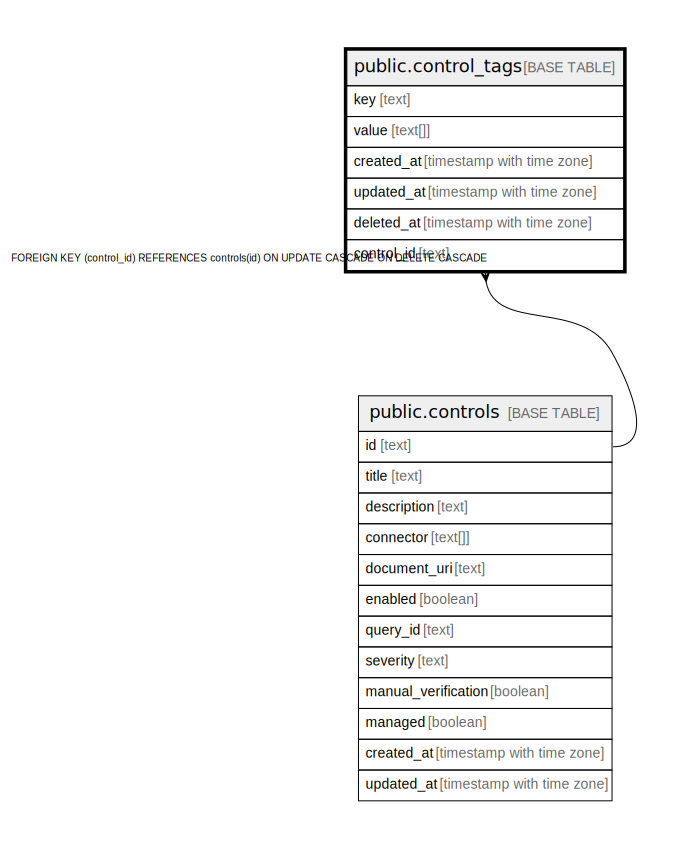

# public.control_tags

## Description

## Columns

| Name | Type | Default | Nullable | Children | Parents | Comment |
| ---- | ---- | ------- | -------- | -------- | ------- | ------- |
| key | text |  | false |  |  |  |
| value | text[] |  | true |  |  |  |
| created_at | timestamp with time zone |  | true |  |  |  |
| updated_at | timestamp with time zone |  | true |  |  |  |
| deleted_at | timestamp with time zone |  | true |  |  |  |
| control_id | text |  | false |  | [public.controls](public.controls.md) |  |

## Constraints

| Name | Type | Definition |
| ---- | ---- | ---------- |
| fk_controls_tags | FOREIGN KEY | FOREIGN KEY (control_id) REFERENCES controls(id) ON UPDATE CASCADE ON DELETE CASCADE |
| control_tags_pkey | PRIMARY KEY | PRIMARY KEY (key, control_id) |

## Indexes

| Name | Definition |
| ---- | ---------- |
| control_tags_pkey | CREATE UNIQUE INDEX control_tags_pkey ON public.control_tags USING btree (key, control_id) |
| idx_control_tags_deleted_at | CREATE INDEX idx_control_tags_deleted_at ON public.control_tags USING btree (deleted_at) |
| idx_key | CREATE INDEX idx_key ON public.control_tags USING btree (key) |

## Relations

---

> Generated by [tbls](https://github.com/k1LoW/tbls)
