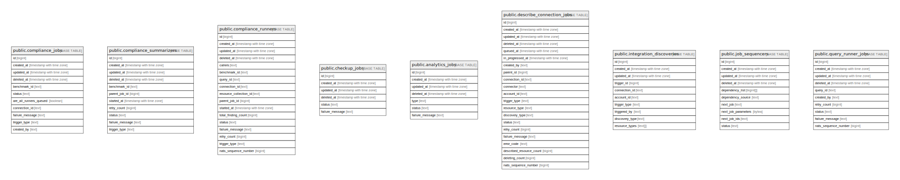

# describe

## Tables

| Name | Columns | Comment | Type |
| ---- | ------- | ------- | ---- |
| [public.compliance_jobs](public.compliance_jobs.md) | 11 |  | BASE TABLE |
| [public.compliance_summarizers](public.compliance_summarizers.md) | 11 |  | BASE TABLE |
| [public.compliance_runners](public.compliance_runners.md) | 17 |  | BASE TABLE |
| [public.checkup_jobs](public.checkup_jobs.md) | 6 |  | BASE TABLE |
| [public.analytics_jobs](public.analytics_jobs.md) | 7 |  | BASE TABLE |
| [public.describe_connection_jobs](public.describe_connection_jobs.md) | 21 |  | BASE TABLE |
| [public.integration_discoveries](public.integration_discoveries.md) | 10 |  | BASE TABLE |
| [public.job_sequencers](public.job_sequencers.md) | 10 |  | BASE TABLE |
| [public.query_runner_jobs](public.query_runner_jobs.md) | 10 |  | BASE TABLE |

## Stored procedures and functions

| Name | ReturnType | Arguments | Type |
| ---- | ------- | ------- | ---- |
| public.uuid_nil | uuid |  | FUNCTION |
| public.uuid_ns_dns | uuid |  | FUNCTION |
| public.uuid_ns_url | uuid |  | FUNCTION |
| public.uuid_ns_oid | uuid |  | FUNCTION |
| public.uuid_ns_x500 | uuid |  | FUNCTION |
| public.uuid_generate_v1 | uuid |  | FUNCTION |
| public.uuid_generate_v1mc | uuid |  | FUNCTION |
| public.uuid_generate_v3 | uuid | namespace uuid, name text | FUNCTION |
| public.uuid_generate_v4 | uuid |  | FUNCTION |
| public.uuid_generate_v5 | uuid | namespace uuid, name text | FUNCTION |
| public.citextin | citext | cstring | FUNCTION |
| public.citextout | cstring | citext | FUNCTION |
| public.citextrecv | citext | internal | FUNCTION |
| public.citextsend | bytea | citext | FUNCTION |
| public.citext | citext | character | FUNCTION |
| public.citext | citext | boolean | FUNCTION |
| public.citext | citext | inet | FUNCTION |
| public.citext_eq | bool | citext, citext | FUNCTION |
| public.citext_ne | bool | citext, citext | FUNCTION |
| public.citext_lt | bool | citext, citext | FUNCTION |
| public.citext_le | bool | citext, citext | FUNCTION |
| public.citext_gt | bool | citext, citext | FUNCTION |
| public.citext_ge | bool | citext, citext | FUNCTION |
| public.citext_cmp | int4 | citext, citext | FUNCTION |
| public.citext_hash | int4 | citext | FUNCTION |
| public.citext_smaller | citext | citext, citext | FUNCTION |
| public.citext_larger | citext | citext, citext | FUNCTION |
| public.min | citext | citext | a |
| public.max | citext | citext | a |
| public.texticlike | bool | citext, citext | FUNCTION |
| public.texticnlike | bool | citext, citext | FUNCTION |
| public.texticregexeq | bool | citext, citext | FUNCTION |
| public.texticregexne | bool | citext, citext | FUNCTION |
| public.texticlike | bool | citext, text | FUNCTION |
| public.texticnlike | bool | citext, text | FUNCTION |
| public.texticregexeq | bool | citext, text | FUNCTION |
| public.texticregexne | bool | citext, text | FUNCTION |
| public.regexp_match | _text | citext, citext | FUNCTION |
| public.regexp_match | _text | citext, citext, text | FUNCTION |
| public.regexp_matches | _text | citext, citext | FUNCTION |
| public.regexp_matches | _text | citext, citext, text | FUNCTION |
| public.regexp_replace | text | citext, citext, text | FUNCTION |
| public.regexp_replace | text | citext, citext, text, text | FUNCTION |
| public.regexp_split_to_array | _text | citext, citext | FUNCTION |
| public.regexp_split_to_array | _text | citext, citext, text | FUNCTION |
| public.regexp_split_to_table | text | citext, citext | FUNCTION |
| public.regexp_split_to_table | text | citext, citext, text | FUNCTION |
| public.strpos | int4 | citext, citext | FUNCTION |
| public.replace | text | citext, citext, citext | FUNCTION |
| public.split_part | text | citext, citext, integer | FUNCTION |
| public.translate | text | citext, citext, text | FUNCTION |
| public.citext_pattern_lt | bool | citext, citext | FUNCTION |
| public.citext_pattern_le | bool | citext, citext | FUNCTION |
| public.citext_pattern_gt | bool | citext, citext | FUNCTION |
| public.citext_pattern_ge | bool | citext, citext | FUNCTION |
| public.citext_pattern_cmp | int4 | citext, citext | FUNCTION |
| public.citext_hash_extended | int8 | citext, bigint | FUNCTION |

## Relations

---

> Generated by [tbls](https://github.com/k1LoW/tbls)
