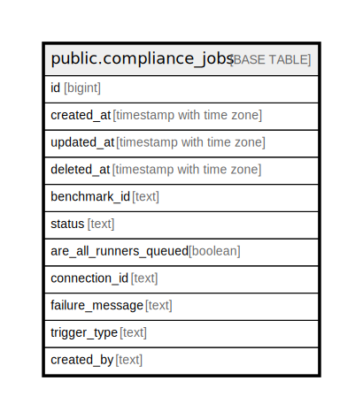

# public.compliance_jobs

## Description

## Columns

| Name | Type | Default | Nullable | Children | Parents | Comment |
| ---- | ---- | ------- | -------- | -------- | ------- | ------- |
| id | bigint | nextval('compliance_jobs_id_seq'::regclass) | false |  |  |  |
| created_at | timestamp with time zone |  | true |  |  |  |
| updated_at | timestamp with time zone |  | true |  |  |  |
| deleted_at | timestamp with time zone |  | true |  |  |  |
| benchmark_id | text |  | true |  |  |  |
| status | text |  | true |  |  |  |
| are_all_runners_queued | boolean |  | true |  |  |  |
| connection_id | text |  | true |  |  |  |
| failure_message | text |  | true |  |  |  |
| trigger_type | text |  | true |  |  |  |
| created_by | text |  | true |  |  |  |

## Constraints

| Name | Type | Definition |
| ---- | ---- | ---------- |
| compliance_jobs_pkey | PRIMARY KEY | PRIMARY KEY (id) |

## Indexes

| Name | Definition |
| ---- | ---------- |
| compliance_jobs_pkey | CREATE UNIQUE INDEX compliance_jobs_pkey ON public.compliance_jobs USING btree (id) |
| idx_compliance_jobs_deleted_at | CREATE INDEX idx_compliance_jobs_deleted_at ON public.compliance_jobs USING btree (deleted_at) |

## Relations

---

> Generated by [tbls](https://github.com/k1LoW/tbls)
