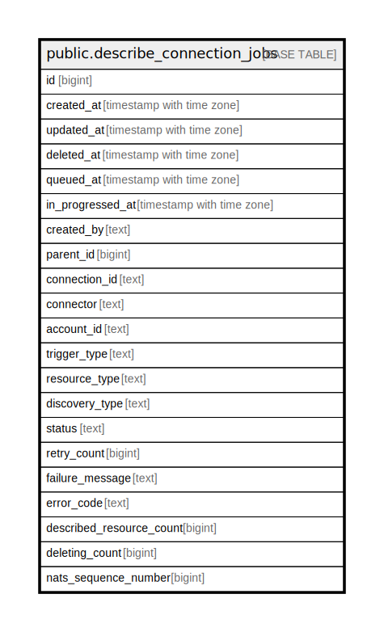

# public.describe_connection_jobs

## Description

## Columns

| Name | Type | Default | Nullable | Children | Parents | Comment |
| ---- | ---- | ------- | -------- | -------- | ------- | ------- |
| id | bigint | nextval('describe_connection_jobs_id_seq'::regclass) | false |  |  |  |
| created_at | timestamp with time zone |  | true |  |  |  |
| updated_at | timestamp with time zone |  | true |  |  |  |
| deleted_at | timestamp with time zone |  | true |  |  |  |
| queued_at | timestamp with time zone |  | true |  |  |  |
| in_progressed_at | timestamp with time zone |  | true |  |  |  |
| created_by | text |  | true |  |  |  |
| parent_id | bigint |  | true |  |  |  |
| connection_id | text |  | true |  |  |  |
| connector | text |  | true |  |  |  |
| account_id | text |  | true |  |  |  |
| trigger_type | text |  | true |  |  |  |
| resource_type | text |  | true |  |  |  |
| discovery_type | text |  | true |  |  |  |
| status | text |  | true |  |  |  |
| retry_count | bigint |  | true |  |  |  |
| failure_message | text |  | true |  |  |  |
| error_code | text |  | true |  |  |  |
| described_resource_count | bigint |  | true |  |  |  |
| deleting_count | bigint |  | true |  |  |  |
| nats_sequence_number | bigint |  | true |  |  |  |

## Constraints

| Name | Type | Definition |
| ---- | ---- | ---------- |
| describe_connection_jobs_pkey | PRIMARY KEY | PRIMARY KEY (id) |

## Indexes

| Name | Definition |
| ---- | ---------- |
| describe_connection_jobs_pkey | CREATE UNIQUE INDEX describe_connection_jobs_pkey ON public.describe_connection_jobs USING btree (id) |
| idx_describe_connection_jobs_resource_type | CREATE INDEX idx_describe_connection_jobs_resource_type ON public.describe_connection_jobs USING btree (resource_type) |
| idx_resource_type_status | CREATE INDEX idx_resource_type_status ON public.describe_connection_jobs USING btree (resource_type, status) |
| idx_describe_connection_jobs_connection_id | CREATE INDEX idx_describe_connection_jobs_connection_id ON public.describe_connection_jobs USING btree (connection_id) |
| idx_source_id_full_discovery | CREATE INDEX idx_source_id_full_discovery ON public.describe_connection_jobs USING btree (connection_id) |
| idx_describe_connection_jobs_parent_id | CREATE INDEX idx_describe_connection_jobs_parent_id ON public.describe_connection_jobs USING btree (parent_id DESC) |
| idx_describe_connection_jobs_deleted_at | CREATE INDEX idx_describe_connection_jobs_deleted_at ON public.describe_connection_jobs USING btree (deleted_at) |
| idx_describe_connection_jobs_updated_at | CREATE INDEX idx_describe_connection_jobs_updated_at ON public.describe_connection_jobs USING btree (updated_at DESC) |
| idx_describe_connection_jobs_status | CREATE INDEX idx_describe_connection_jobs_status ON public.describe_connection_jobs USING btree (status) |

## Relations

---

> Generated by [tbls](https://github.com/k1LoW/tbls)
