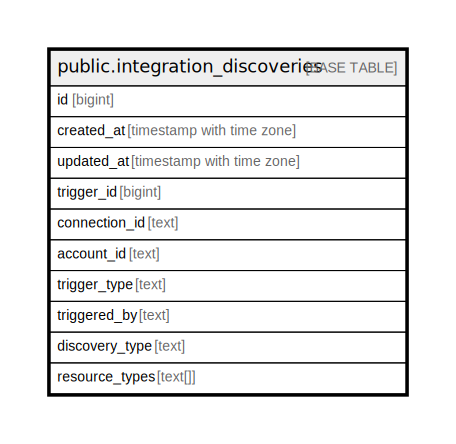

# public.integration_discoveries

## Description

## Columns

| Name | Type | Default | Nullable | Children | Parents | Comment |
| ---- | ---- | ------- | -------- | -------- | ------- | ------- |
| id | bigint | nextval('integration_discoveries_id_seq'::regclass) | false |  |  |  |
| created_at | timestamp with time zone |  | true |  |  |  |
| updated_at | timestamp with time zone |  | true |  |  |  |
| trigger_id | bigint |  | true |  |  |  |
| connection_id | text |  | true |  |  |  |
| account_id | text |  | true |  |  |  |
| trigger_type | text |  | true |  |  |  |
| triggered_by | text |  | true |  |  |  |
| discovery_type | text |  | true |  |  |  |
| resource_types | text[] |  | true |  |  |  |

## Constraints

| Name | Type | Definition |
| ---- | ---- | ---------- |
| integration_discoveries_pkey | PRIMARY KEY | PRIMARY KEY (id) |

## Indexes

| Name | Definition |
| ---- | ---------- |
| integration_discoveries_pkey | CREATE UNIQUE INDEX integration_discoveries_pkey ON public.integration_discoveries USING btree (id) |

## Relations

---

> Generated by [tbls](https://github.com/k1LoW/tbls)
