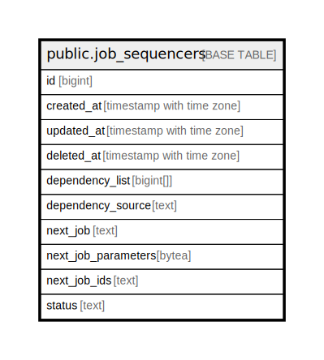

# public.job_sequencers

## Description

## Columns

| Name | Type | Default | Nullable | Children | Parents | Comment |
| ---- | ---- | ------- | -------- | -------- | ------- | ------- |
| id | bigint | nextval('job_sequencers_id_seq'::regclass) | false |  |  |  |
| created_at | timestamp with time zone |  | true |  |  |  |
| updated_at | timestamp with time zone |  | true |  |  |  |
| deleted_at | timestamp with time zone |  | true |  |  |  |
| dependency_list | bigint[] |  | true |  |  |  |
| dependency_source | text |  | true |  |  |  |
| next_job | text |  | true |  |  |  |
| next_job_parameters | bytea |  | true |  |  |  |
| next_job_ids | text |  | true |  |  |  |
| status | text |  | true |  |  |  |

## Constraints

| Name | Type | Definition |
| ---- | ---- | ---------- |
| job_sequencers_pkey | PRIMARY KEY | PRIMARY KEY (id) |

## Indexes

| Name | Definition |
| ---- | ---------- |
| job_sequencers_pkey | CREATE UNIQUE INDEX job_sequencers_pkey ON public.job_sequencers USING btree (id) |
| idx_job_sequencers_deleted_at | CREATE INDEX idx_job_sequencers_deleted_at ON public.job_sequencers USING btree (deleted_at) |

## Relations

---

> Generated by [tbls](https://github.com/k1LoW/tbls)
