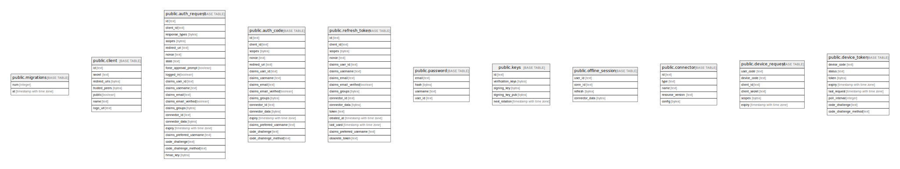

# dex

## Tables

| Name | Columns | Comment | Type |
| ---- | ------- | ------- | ---- |
| [public.migrations](public.migrations.md) | 2 |  | BASE TABLE |
| [public.client](public.client.md) | 7 |  | BASE TABLE |
| [public.auth_request](public.auth_request.md) | 21 |  | BASE TABLE |
| [public.auth_code](public.auth_code.md) | 16 |  | BASE TABLE |
| [public.refresh_token](public.refresh_token.md) | 16 |  | BASE TABLE |
| [public.password](public.password.md) | 4 |  | BASE TABLE |
| [public.keys](public.keys.md) | 5 |  | BASE TABLE |
| [public.offline_session](public.offline_session.md) | 4 |  | BASE TABLE |
| [public.connector](public.connector.md) | 5 |  | BASE TABLE |
| [public.device_request](public.device_request.md) | 6 |  | BASE TABLE |
| [public.device_token](public.device_token.md) | 8 |  | BASE TABLE |

## Stored procedures and functions

| Name | ReturnType | Arguments | Type |
| ---- | ------- | ------- | ---- |
| public.uuid_nil | uuid |  | FUNCTION |
| public.uuid_ns_dns | uuid |  | FUNCTION |
| public.uuid_ns_url | uuid |  | FUNCTION |
| public.uuid_ns_oid | uuid |  | FUNCTION |
| public.uuid_ns_x500 | uuid |  | FUNCTION |
| public.uuid_generate_v1 | uuid |  | FUNCTION |
| public.uuid_generate_v1mc | uuid |  | FUNCTION |
| public.uuid_generate_v3 | uuid | namespace uuid, name text | FUNCTION |
| public.uuid_generate_v4 | uuid |  | FUNCTION |
| public.uuid_generate_v5 | uuid | namespace uuid, name text | FUNCTION |

## Relations

---

> Generated by [tbls](https://github.com/k1LoW/tbls)
