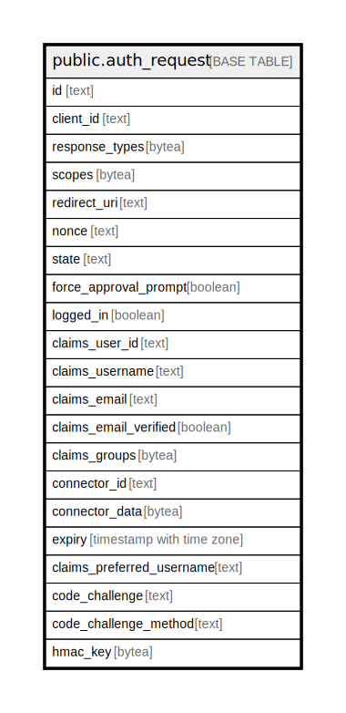

# public.auth_request

## Description

## Columns

| Name | Type | Default | Nullable | Children | Parents | Comment |
| ---- | ---- | ------- | -------- | -------- | ------- | ------- |
| id | text |  | false |  |  |  |
| client_id | text |  | false |  |  |  |
| response_types | bytea |  | false |  |  |  |
| scopes | bytea |  | false |  |  |  |
| redirect_uri | text |  | false |  |  |  |
| nonce | text |  | false |  |  |  |
| state | text |  | false |  |  |  |
| force_approval_prompt | boolean |  | false |  |  |  |
| logged_in | boolean |  | false |  |  |  |
| claims_user_id | text |  | false |  |  |  |
| claims_username | text |  | false |  |  |  |
| claims_email | text |  | false |  |  |  |
| claims_email_verified | boolean |  | false |  |  |  |
| claims_groups | bytea |  | false |  |  |  |
| connector_id | text |  | false |  |  |  |
| connector_data | bytea |  | true |  |  |  |
| expiry | timestamp with time zone |  | false |  |  |  |
| claims_preferred_username | text | ''::text | false |  |  |  |
| code_challenge | text | ''::text | false |  |  |  |
| code_challenge_method | text | ''::text | false |  |  |  |
| hmac_key | bytea |  | true |  |  |  |

## Constraints

| Name | Type | Definition |
| ---- | ---- | ---------- |
| auth_request_pkey | PRIMARY KEY | PRIMARY KEY (id) |

## Indexes

| Name | Definition |
| ---- | ---------- |
| auth_request_pkey | CREATE UNIQUE INDEX auth_request_pkey ON public.auth_request USING btree (id) |

## Relations

---

> Generated by [tbls](https://github.com/k1LoW/tbls)
