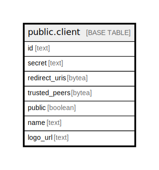

# public.client

## Description

## Columns

| Name | Type | Default | Nullable | Children | Parents | Comment |
| ---- | ---- | ------- | -------- | -------- | ------- | ------- |
| id | text |  | false |  |  |  |
| secret | text |  | false |  |  |  |
| redirect_uris | bytea |  | false |  |  |  |
| trusted_peers | bytea |  | false |  |  |  |
| public | boolean |  | false |  |  |  |
| name | text |  | false |  |  |  |
| logo_url | text |  | false |  |  |  |

## Constraints

| Name | Type | Definition |
| ---- | ---- | ---------- |
| client_pkey | PRIMARY KEY | PRIMARY KEY (id) |

## Indexes

| Name | Definition |
| ---- | ---------- |
| client_pkey | CREATE UNIQUE INDEX client_pkey ON public.client USING btree (id) |

## Relations

---

> Generated by [tbls](https://github.com/k1LoW/tbls)
