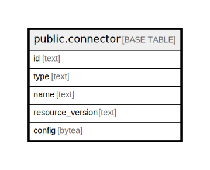

# public.connector

## Description

## Columns

| Name | Type | Default | Nullable | Children | Parents | Comment |
| ---- | ---- | ------- | -------- | -------- | ------- | ------- |
| id | text |  | false |  |  |  |
| type | text |  | false |  |  |  |
| name | text |  | false |  |  |  |
| resource_version | text |  | false |  |  |  |
| config | bytea |  | true |  |  |  |

## Constraints

| Name | Type | Definition |
| ---- | ---- | ---------- |
| connector_pkey | PRIMARY KEY | PRIMARY KEY (id) |

## Indexes

| Name | Definition |
| ---- | ---------- |
| connector_pkey | CREATE UNIQUE INDEX connector_pkey ON public.connector USING btree (id) |

## Relations

---

> Generated by [tbls](https://github.com/k1LoW/tbls)
