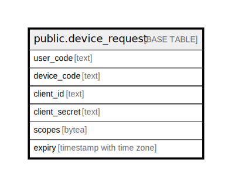

# public.device_request

## Description

## Columns

| Name | Type | Default | Nullable | Children | Parents | Comment |
| ---- | ---- | ------- | -------- | -------- | ------- | ------- |
| user_code | text |  | false |  |  |  |
| device_code | text |  | false |  |  |  |
| client_id | text |  | false |  |  |  |
| client_secret | text |  | true |  |  |  |
| scopes | bytea |  | false |  |  |  |
| expiry | timestamp with time zone |  | false |  |  |  |

## Constraints

| Name | Type | Definition |
| ---- | ---- | ---------- |
| device_request_pkey | PRIMARY KEY | PRIMARY KEY (user_code) |

## Indexes

| Name | Definition |
| ---- | ---------- |
| device_request_pkey | CREATE UNIQUE INDEX device_request_pkey ON public.device_request USING btree (user_code) |

## Relations

---

> Generated by [tbls](https://github.com/k1LoW/tbls)
