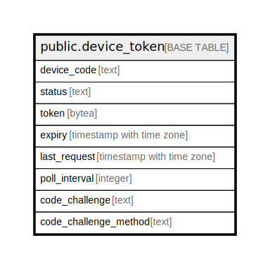

# public.device_token

## Description

## Columns

| Name | Type | Default | Nullable | Children | Parents | Comment |
| ---- | ---- | ------- | -------- | -------- | ------- | ------- |
| device_code | text |  | false |  |  |  |
| status | text |  | false |  |  |  |
| token | bytea |  | true |  |  |  |
| expiry | timestamp with time zone |  | false |  |  |  |
| last_request | timestamp with time zone |  | false |  |  |  |
| poll_interval | integer |  | false |  |  |  |
| code_challenge | text | ''::text | false |  |  |  |
| code_challenge_method | text | ''::text | false |  |  |  |

## Constraints

| Name | Type | Definition |
| ---- | ---- | ---------- |
| device_token_pkey | PRIMARY KEY | PRIMARY KEY (device_code) |

## Indexes

| Name | Definition |
| ---- | ---------- |
| device_token_pkey | CREATE UNIQUE INDEX device_token_pkey ON public.device_token USING btree (device_code) |

## Relations

---

> Generated by [tbls](https://github.com/k1LoW/tbls)
