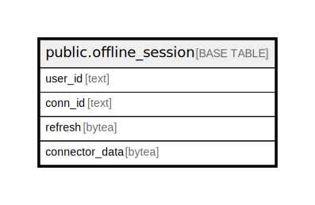

# public.offline_session

## Description

## Columns

| Name | Type | Default | Nullable | Children | Parents | Comment |
| ---- | ---- | ------- | -------- | -------- | ------- | ------- |
| user_id | text |  | false |  |  |  |
| conn_id | text |  | false |  |  |  |
| refresh | bytea |  | false |  |  |  |
| connector_data | bytea |  | true |  |  |  |

## Constraints

| Name | Type | Definition |
| ---- | ---- | ---------- |
| offline_session_pkey | PRIMARY KEY | PRIMARY KEY (user_id, conn_id) |

## Indexes

| Name | Definition |
| ---- | ---------- |
| offline_session_pkey | CREATE UNIQUE INDEX offline_session_pkey ON public.offline_session USING btree (user_id, conn_id) |

## Relations

---

> Generated by [tbls](https://github.com/k1LoW/tbls)
