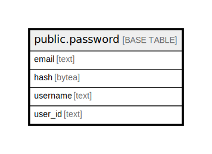

# public.password

## Description

## Columns

| Name | Type | Default | Nullable | Children | Parents | Comment |
| ---- | ---- | ------- | -------- | -------- | ------- | ------- |
| email | text |  | false |  |  |  |
| hash | bytea |  | false |  |  |  |
| username | text |  | false |  |  |  |
| user_id | text |  | false |  |  |  |

## Constraints

| Name | Type | Definition |
| ---- | ---- | ---------- |
| password_pkey | PRIMARY KEY | PRIMARY KEY (email) |

## Indexes

| Name | Definition |
| ---- | ---------- |
| password_pkey | CREATE UNIQUE INDEX password_pkey ON public.password USING btree (email) |

## Relations

---

> Generated by [tbls](https://github.com/k1LoW/tbls)
