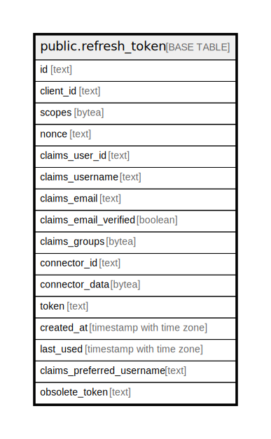

# public.refresh_token

## Description

## Columns

| Name | Type | Default | Nullable | Children | Parents | Comment |
| ---- | ---- | ------- | -------- | -------- | ------- | ------- |
| id | text |  | false |  |  |  |
| client_id | text |  | false |  |  |  |
| scopes | bytea |  | false |  |  |  |
| nonce | text |  | false |  |  |  |
| claims_user_id | text |  | false |  |  |  |
| claims_username | text |  | false |  |  |  |
| claims_email | text |  | false |  |  |  |
| claims_email_verified | boolean |  | false |  |  |  |
| claims_groups | bytea |  | false |  |  |  |
| connector_id | text |  | false |  |  |  |
| connector_data | bytea |  | true |  |  |  |
| token | text | ''::text | false |  |  |  |
| created_at | timestamp with time zone | '0001-01-01 00:00:00+00'::timestamp with time zone | false |  |  |  |
| last_used | timestamp with time zone | '0001-01-01 00:00:00+00'::timestamp with time zone | false |  |  |  |
| claims_preferred_username | text | ''::text | false |  |  |  |
| obsolete_token | text | ''::text | true |  |  |  |

## Constraints

| Name | Type | Definition |
| ---- | ---- | ---------- |
| refresh_token_pkey | PRIMARY KEY | PRIMARY KEY (id) |

## Indexes

| Name | Definition |
| ---- | ---------- |
| refresh_token_pkey | CREATE UNIQUE INDEX refresh_token_pkey ON public.refresh_token USING btree (id) |

## Relations

---

> Generated by [tbls](https://github.com/k1LoW/tbls)
