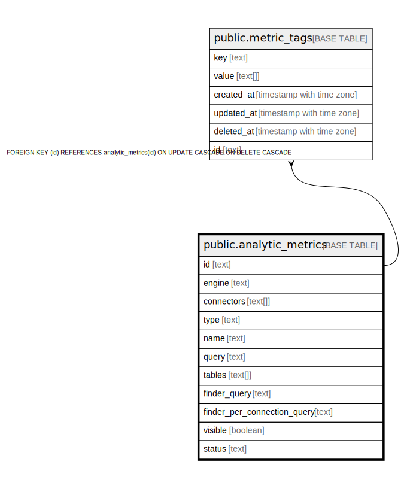

# public.analytic_metrics

## Description

## Columns

| Name | Type | Default | Nullable | Children | Parents | Comment |
| ---- | ---- | ------- | -------- | -------- | ------- | ------- |
| id | text |  | false | [public.metric_tags](public.metric_tags.md) |  |  |
| engine | text |  | true |  |  |  |
| connectors | text[] |  | true |  |  |  |
| type | text |  | true |  |  |  |
| name | text |  | true |  |  |  |
| query | text |  | true |  |  |  |
| tables | text[] |  | true |  |  |  |
| finder_query | text |  | true |  |  |  |
| finder_per_connection_query | text |  | true |  |  |  |
| visible | boolean |  | true |  |  |  |
| status | text |  | true |  |  |  |

## Constraints

| Name | Type | Definition |
| ---- | ---- | ---------- |
| analytic_metrics_pkey | PRIMARY KEY | PRIMARY KEY (id) |

## Indexes

| Name | Definition |
| ---- | ---------- |
| analytic_metrics_pkey | CREATE UNIQUE INDEX analytic_metrics_pkey ON public.analytic_metrics USING btree (id) |

## Relations

---

> Generated by [tbls](https://github.com/k1LoW/tbls)
