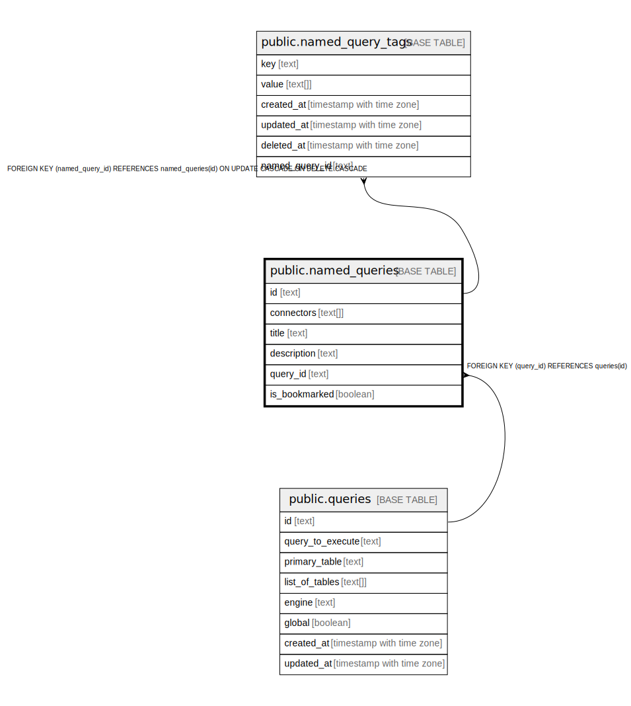

# public.named_queries

## Description

## Columns

| Name | Type | Default | Nullable | Children | Parents | Comment |
| ---- | ---- | ------- | -------- | -------- | ------- | ------- |
| id | text |  | false | [public.named_query_tags](public.named_query_tags.md) |  |  |
| connectors | text[] |  | true |  |  |  |
| title | text |  | true |  |  |  |
| description | text |  | true |  |  |  |
| query_id | text |  | true |  | [public.queries](public.queries.md) |  |
| is_bookmarked | boolean |  | true |  |  |  |

## Constraints

| Name | Type | Definition |
| ---- | ---- | ---------- |
| fk_queries_named_query | FOREIGN KEY | FOREIGN KEY (query_id) REFERENCES queries(id) |
| named_queries_pkey | PRIMARY KEY | PRIMARY KEY (id) |

## Indexes

| Name | Definition |
| ---- | ---------- |
| named_queries_pkey | CREATE UNIQUE INDEX named_queries_pkey ON public.named_queries USING btree (id) |

## Relations

---

> Generated by [tbls](https://github.com/k1LoW/tbls)
