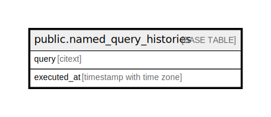

# public.named_query_histories

## Description

## Columns

| Name | Type | Default | Nullable | Children | Parents | Comment |
| ---- | ---- | ------- | -------- | -------- | ------- | ------- |
| query | citext |  | false |  |  |  |
| executed_at | timestamp with time zone |  | true |  |  |  |

## Constraints

| Name | Type | Definition |
| ---- | ---- | ---------- |
| named_query_histories_pkey | PRIMARY KEY | PRIMARY KEY (query) |

## Indexes

| Name | Definition |
| ---- | ---------- |
| named_query_histories_pkey | CREATE UNIQUE INDEX named_query_histories_pkey ON public.named_query_histories USING btree (query) |

## Relations

---

> Generated by [tbls](https://github.com/k1LoW/tbls)
