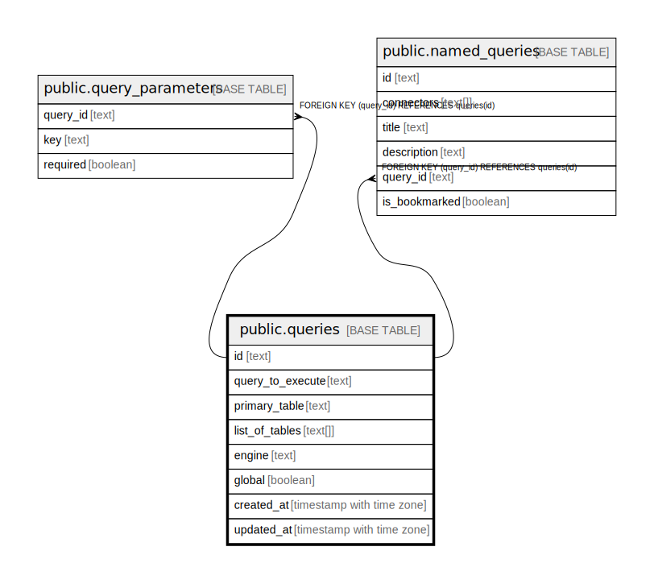

# public.queries

## Description

## Columns

| Name | Type | Default | Nullable | Children | Parents | Comment |
| ---- | ---- | ------- | -------- | -------- | ------- | ------- |
| id | text |  | false | [public.query_parameters](public.query_parameters.md) [public.named_queries](public.named_queries.md) |  |  |
| query_to_execute | text |  | true |  |  |  |
| primary_table | text |  | true |  |  |  |
| list_of_tables | text[] |  | true |  |  |  |
| engine | text |  | true |  |  |  |
| global | boolean |  | true |  |  |  |
| created_at | timestamp with time zone |  | true |  |  |  |
| updated_at | timestamp with time zone |  | true |  |  |  |

## Constraints

| Name | Type | Definition |
| ---- | ---- | ---------- |
| queries_pkey | PRIMARY KEY | PRIMARY KEY (id) |

## Indexes

| Name | Definition |
| ---- | ---------- |
| queries_pkey | CREATE UNIQUE INDEX queries_pkey ON public.queries USING btree (id) |

## Relations

---

> Generated by [tbls](https://github.com/k1LoW/tbls)
