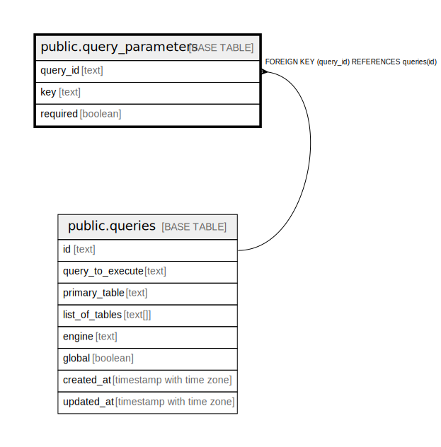

# public.query_parameters

## Description

## Columns

| Name | Type | Default | Nullable | Children | Parents | Comment |
| ---- | ---- | ------- | -------- | -------- | ------- | ------- |
| query_id | text |  | false |  | [public.queries](public.queries.md) |  |
| key | text |  | false |  |  |  |
| required | boolean |  | false |  |  |  |

## Constraints

| Name | Type | Definition |
| ---- | ---- | ---------- |
| fk_queries_parameters | FOREIGN KEY | FOREIGN KEY (query_id) REFERENCES queries(id) |
| query_parameters_pkey | PRIMARY KEY | PRIMARY KEY (query_id, key) |

## Indexes

| Name | Definition |
| ---- | ---------- |
| query_parameters_pkey | CREATE UNIQUE INDEX query_parameters_pkey ON public.query_parameters USING btree (query_id, key) |

## Relations

---

> Generated by [tbls](https://github.com/k1LoW/tbls)
