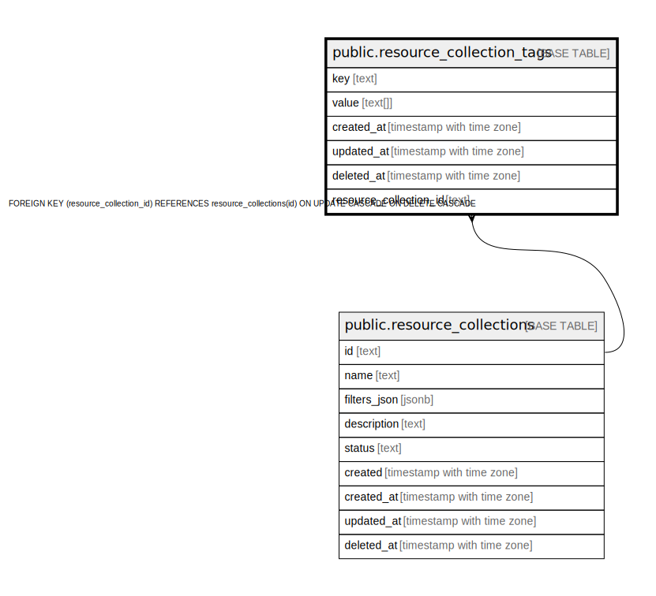

# public.resource_collection_tags

## Description

## Columns

| Name | Type | Default | Nullable | Children | Parents | Comment |
| ---- | ---- | ------- | -------- | -------- | ------- | ------- |
| key | text |  | false |  |  |  |
| value | text[] |  | true |  |  |  |
| created_at | timestamp with time zone |  | true |  |  |  |
| updated_at | timestamp with time zone |  | true |  |  |  |
| deleted_at | timestamp with time zone |  | true |  |  |  |
| resource_collection_id | text |  | false |  | [public.resource_collections](public.resource_collections.md) |  |

## Constraints

| Name | Type | Definition |
| ---- | ---- | ---------- |
| fk_resource_collections_tags | FOREIGN KEY | FOREIGN KEY (resource_collection_id) REFERENCES resource_collections(id) ON UPDATE CASCADE ON DELETE CASCADE |
| resource_collection_tags_pkey | PRIMARY KEY | PRIMARY KEY (key, resource_collection_id) |

## Indexes

| Name | Definition |
| ---- | ---------- |
| resource_collection_tags_pkey | CREATE UNIQUE INDEX resource_collection_tags_pkey ON public.resource_collection_tags USING btree (key, resource_collection_id) |
| idx_resource_collection_tags_deleted_at | CREATE INDEX idx_resource_collection_tags_deleted_at ON public.resource_collection_tags USING btree (deleted_at) |

## Relations

---

> Generated by [tbls](https://github.com/k1LoW/tbls)
