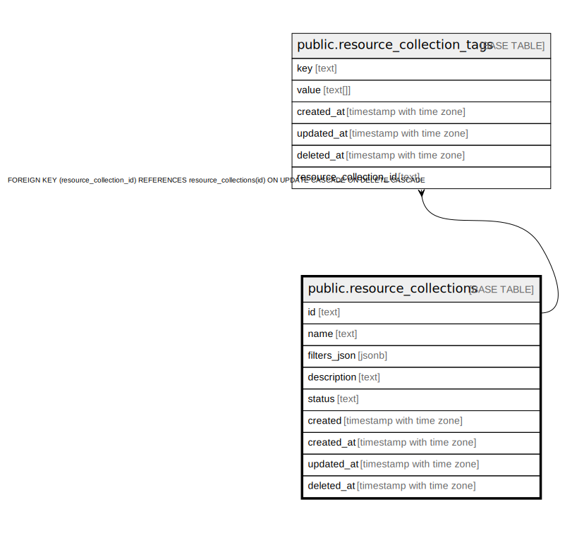

# public.resource_collections

## Description

## Columns

| Name | Type | Default | Nullable | Children | Parents | Comment |
| ---- | ---- | ------- | -------- | -------- | ------- | ------- |
| id | text |  | false | [public.resource_collection_tags](public.resource_collection_tags.md) |  |  |
| name | text |  | true |  |  |  |
| filters_json | jsonb |  | true |  |  |  |
| description | text |  | true |  |  |  |
| status | text |  | true |  |  |  |
| created | timestamp with time zone |  | true |  |  |  |
| created_at | timestamp with time zone |  | true |  |  |  |
| updated_at | timestamp with time zone |  | true |  |  |  |
| deleted_at | timestamp with time zone |  | true |  |  |  |

## Constraints

| Name | Type | Definition |
| ---- | ---- | ---------- |
| resource_collections_pkey | PRIMARY KEY | PRIMARY KEY (id) |

## Indexes

| Name | Definition |
| ---- | ---------- |
| resource_collections_pkey | CREATE UNIQUE INDEX resource_collections_pkey ON public.resource_collections USING btree (id) |
| idx_resource_collections_deleted_at | CREATE INDEX idx_resource_collections_deleted_at ON public.resource_collections USING btree (deleted_at) |

## Relations

---

> Generated by [tbls](https://github.com/k1LoW/tbls)
