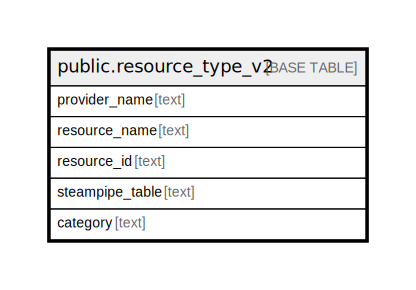

# public.resource_type_v2

## Description

## Columns

| Name | Type | Default | Nullable | Children | Parents | Comment |
| ---- | ---- | ------- | -------- | -------- | ------- | ------- |
| provider_name | text |  | true |  |  |  |
| resource_name | text |  | true |  |  |  |
| resource_id | text |  | false |  |  |  |
| steampipe_table | text |  | true |  |  |  |
| category | text |  | true |  |  |  |

## Constraints

| Name | Type | Definition |
| ---- | ---- | ---------- |
| resource_type_v2_pkey | PRIMARY KEY | PRIMARY KEY (resource_id) |

## Indexes

| Name | Definition |
| ---- | ---------- |
| resource_type_v2_pkey | CREATE UNIQUE INDEX resource_type_v2_pkey ON public.resource_type_v2 USING btree (resource_id) |

## Relations

---

> Generated by [tbls](https://github.com/k1LoW/tbls)
