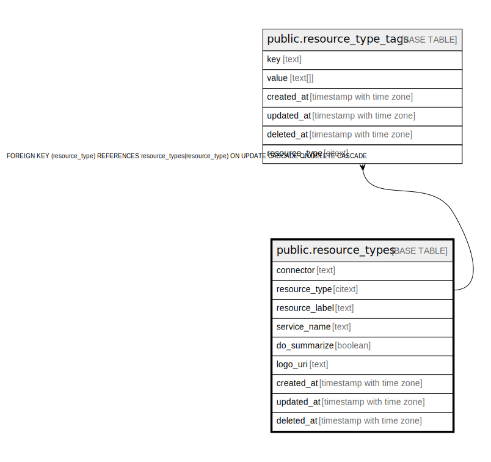

# public.resource_types

## Description

## Columns

| Name | Type | Default | Nullable | Children | Parents | Comment |
| ---- | ---- | ------- | -------- | -------- | ------- | ------- |
| connector | text |  | true |  |  |  |
| resource_type | citext |  | false | [public.resource_type_tags](public.resource_type_tags.md) |  |  |
| resource_label | text |  | true |  |  |  |
| service_name | text |  | true |  |  |  |
| do_summarize | boolean |  | true |  |  |  |
| logo_uri | text |  | true |  |  |  |
| created_at | timestamp with time zone |  | true |  |  |  |
| updated_at | timestamp with time zone |  | true |  |  |  |
| deleted_at | timestamp with time zone |  | true |  |  |  |

## Constraints

| Name | Type | Definition |
| ---- | ---- | ---------- |
| resource_types_pkey | PRIMARY KEY | PRIMARY KEY (resource_type) |

## Indexes

| Name | Definition |
| ---- | ---------- |
| resource_types_pkey | CREATE UNIQUE INDEX resource_types_pkey ON public.resource_types USING btree (resource_type) |
| idx_resource_types_deleted_at | CREATE INDEX idx_resource_types_deleted_at ON public.resource_types USING btree (deleted_at) |
| idx_resource_types_service_name | CREATE INDEX idx_resource_types_service_name ON public.resource_types USING btree (service_name) |
| idx_resource_types_connector | CREATE INDEX idx_resource_types_connector ON public.resource_types USING btree (connector) |

## Relations

---

> Generated by [tbls](https://github.com/k1LoW/tbls)
