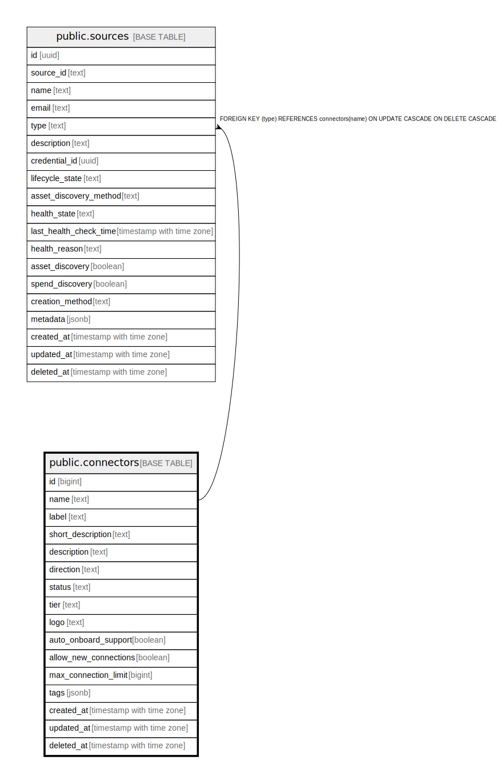

# public.connectors

## Description

## Columns

| Name | Type | Default | Nullable | Children | Parents | Comment |
| ---- | ---- | ------- | -------- | -------- | ------- | ------- |
| id | bigint |  | true |  |  |  |
| name | text |  | false | [public.sources](public.sources.md) |  |  |
| label | text |  | true |  |  |  |
| short_description | text |  | true |  |  |  |
| description | text |  | true |  |  |  |
| direction | text | 'ingress'::text | true |  |  |  |
| status | text | 'enabled'::text | true |  |  |  |
| tier | text | 'Community'::text | true |  |  |  |
| logo | text | ''::text | true |  |  |  |
| auto_onboard_support | boolean | false | true |  |  |  |
| allow_new_connections | boolean | true | true |  |  |  |
| max_connection_limit | bigint | 25 | true |  |  |  |
| tags | jsonb | '{}'::jsonb | true |  |  |  |
| created_at | timestamp with time zone |  | true |  |  |  |
| updated_at | timestamp with time zone |  | true |  |  |  |
| deleted_at | timestamp with time zone |  | true |  |  |  |

## Constraints

| Name | Type | Definition |
| ---- | ---- | ---------- |
| connectors_pkey | PRIMARY KEY | PRIMARY KEY (name) |

## Indexes

| Name | Definition |
| ---- | ---------- |
| connectors_pkey | CREATE UNIQUE INDEX connectors_pkey ON public.connectors USING btree (name) |
| idx_connectors_deleted_at | CREATE INDEX idx_connectors_deleted_at ON public.connectors USING btree (deleted_at) |

## Relations

---

> Generated by [tbls](https://github.com/k1LoW/tbls)
