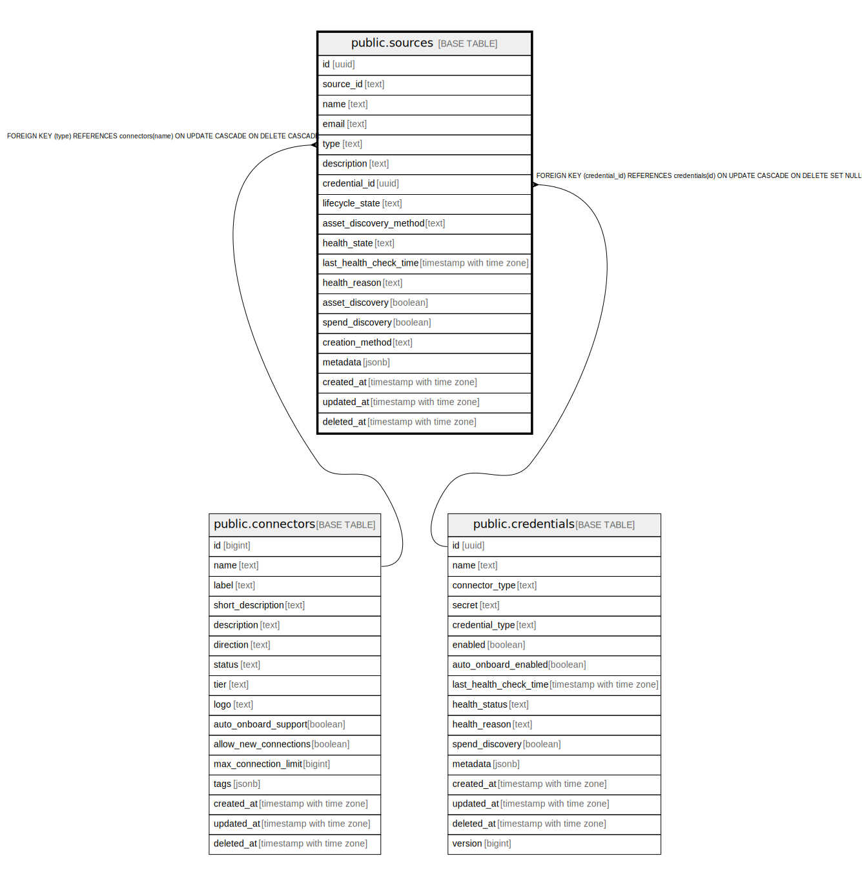

# public.sources

## Description

## Columns

| Name | Type | Default | Nullable | Children | Parents | Comment |
| ---- | ---- | ------- | -------- | -------- | ------- | ------- |
| id | uuid | uuid_generate_v4() | false |  |  |  |
| source_id | text |  | true |  |  |  |
| name | text |  | false |  |  |  |
| email | text |  | true |  |  |  |
| type | text |  | false |  | [public.connectors](public.connectors.md) |  |
| description | text |  | true |  |  |  |
| credential_id | uuid |  | true |  | [public.credentials](public.credentials.md) |  |
| lifecycle_state | text | 'enabled'::text | false |  |  |  |
| asset_discovery_method | text | 'scheduled'::text | false |  |  |  |
| health_state | text |  | true |  |  |  |
| last_health_check_time | timestamp with time zone | now() | false |  |  |  |
| health_reason | text |  | true |  |  |  |
| asset_discovery | boolean |  | true |  |  |  |
| spend_discovery | boolean |  | true |  |  |  |
| creation_method | text | 'manual'::text | false |  |  |  |
| metadata | jsonb | '{}'::jsonb | true |  |  |  |
| created_at | timestamp with time zone |  | true |  |  |  |
| updated_at | timestamp with time zone |  | true |  |  |  |
| deleted_at | timestamp with time zone |  | true |  |  |  |

## Constraints

| Name | Type | Definition |
| ---- | ---- | ---------- |
| fk_sources_connector | FOREIGN KEY | FOREIGN KEY (type) REFERENCES connectors(name) ON UPDATE CASCADE ON DELETE CASCADE |
| fk_sources_credential | FOREIGN KEY | FOREIGN KEY (credential_id) REFERENCES credentials(id) ON UPDATE CASCADE ON DELETE SET NULL |
| sources_pkey | PRIMARY KEY | PRIMARY KEY (id) |
| idx_sources_source_id | UNIQUE | UNIQUE (source_id) |

## Indexes

| Name | Definition |
| ---- | ---------- |
| sources_pkey | CREATE UNIQUE INDEX sources_pkey ON public.sources USING btree (id) |
| idx_sources_deleted_at | CREATE INDEX idx_sources_deleted_at ON public.sources USING btree (deleted_at) |
| idx_source_id | CREATE UNIQUE INDEX idx_source_id ON public.sources USING btree (source_id) |
| idx_sources_source_id | CREATE UNIQUE INDEX idx_sources_source_id ON public.sources USING btree (source_id) |

## Relations

---

> Generated by [tbls](https://github.com/k1LoW/tbls)
