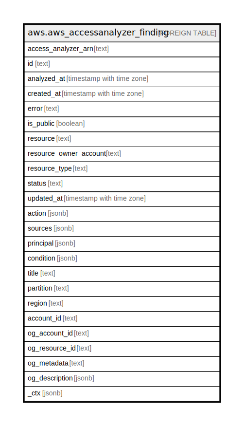

# aws.aws_accessanalyzer_finding

## Description

AWS Access Analyzer Finding

## Columns

| Name | Type | Default | Nullable | Children | Parents | Comment |
| ---- | ---- | ------- | -------- | -------- | ------- | ------- |
| access_analyzer_arn | text |  | true |  |  | The Amazon Resource Name (ARN) of the analyzer that generated the finding. |
| id | text |  | true |  |  | The ID of the finding. |
| analyzed_at | timestamp with time zone |  | true |  |  | The time at which the resource-based policy that generated the finding was analyzed. |
| created_at | timestamp with time zone |  | true |  |  | The time at which the finding was created. |
| error | text |  | true |  |  | The error that resulted in an Error finding. |
| is_public | boolean |  | true |  |  | Indicates whether the finding reports a resource that has a policy that allows public access. |
| resource | text |  | true |  |  | The resource that the external principal has access to. |
| resource_owner_account | text |  | true |  |  | The Amazon Web Services account ID that owns the resource. |
| resource_type | text |  | true |  |  | The type of the resource that the external principal has access to. |
| status | text |  | true |  |  | The status of the finding. |
| updated_at | timestamp with time zone |  | true |  |  | The time at which the finding was most recently updated. |
| action | jsonb |  | true |  |  | The action in the analyzed policy statement that an external principal has permission to use. |
| sources | jsonb |  | true |  |  | The sources of the finding, indicating how the access that generated the finding is granted. It is populated for Amazon S3 bucket findings. |
| principal | jsonb |  | true |  |  | The external principal that has access to a resource within the zone of trust. |
| condition | jsonb |  | true |  |  | The condition in the analyzed policy statement that resulted in a finding. |
| title | text |  | true |  |  | Title of the resource. |
| partition | text |  | true |  |  | The AWS partition in which the resource is located (aws, aws-cn, or aws-us-gov). |
| region | text |  | true |  |  | The AWS Region in which the resource is located. |
| account_id | text |  | true |  |  | The AWS Account ID in which the resource is located. |
| og_account_id | text |  | true |  |  | The Platform Account ID in which the resource is located. |
| og_resource_id | text |  | true |  |  | The unique ID of the resource in opengovernance. |
| og_metadata | text |  | true |  |  | Platform Metadata of the AWS resource. |
| og_description | jsonb |  | true |  |  | The full model description of the resource |
| _ctx | jsonb |  | true |  |  | Steampipe context in JSON form, e.g. connection_name. |

## Relations

---

> Generated by [tbls](https://github.com/k1LoW/tbls)
