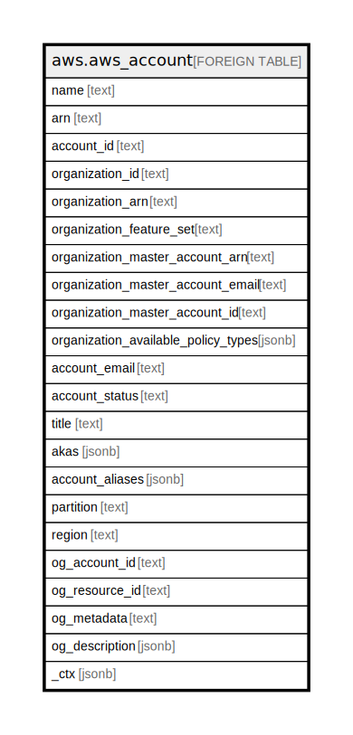

# aws.aws_account

## Description

AWS Account

## Columns

| Name | Type | Default | Nullable | Children | Parents | Comment |
| ---- | ---- | ------- | -------- | -------- | ------- | ------- |
| name | text |  | true |  |  | Account Name |
| arn | text |  | true |  |  | The Amazon Resource Name (ARN) specifying the account. |
| account_id | text |  | true |  |  | Title of the resource. |
| organization_id | text |  | true |  |  | The unique identifier (ID) of an organization, if applicable. |
| organization_arn | text |  | true |  |  | The Amazon Resource Name (ARN) of an organization. |
| organization_feature_set | text |  | true |  |  | Specifies the functionality that currently is available to the organization. If set to "ALL", then all features are enabled and policies can be applied to accounts in the organization. If set to "CONSOLIDATED_BILLING", then only consolidated billing functionality is available. |
| organization_master_account_arn | text |  | true |  |  | The Amazon Resource Name (ARN) of the account that is designated as the management account for the organization |
| organization_master_account_email | text |  | true |  |  | The email address that is associated with the AWS account that is designated as the management account for the organization |
| organization_master_account_id | text |  | true |  |  | The unique identifier (ID) of the management account of an organization |
| organization_available_policy_types | jsonb |  | true |  |  | The Region opt-in status. The possible values are opt-in-not-required, opted-in, and not-opted-in |
| account_email | text |  | true |  |  | Account email |
| account_status | text |  | true |  |  | Account statue |
| title | text |  | true |  |  | Title of the resource. |
| akas | jsonb |  | true |  |  | Array of globally unique identifier strings (also known as) for the resource. |
| account_aliases | jsonb |  | true |  |  | A list of aliases associated with the account, if applicable. |
| partition | text |  | true |  |  | The AWS partition in which the resource is located (aws, aws-cn, or aws-us-gov). |
| region | text |  | true |  |  | The AWS Region in which the resource is located. |
| og_account_id | text |  | true |  |  | The Platform Account ID in which the resource is located. |
| og_resource_id | text |  | true |  |  | The unique ID of the resource in opengovernance. |
| og_metadata | text |  | true |  |  | Platform Metadata of the AWS resource. |
| og_description | jsonb |  | true |  |  | The full model description of the resource |
| _ctx | jsonb |  | true |  |  | Steampipe context in JSON form, e.g. connection_name. |

## Relations

---

> Generated by [tbls](https://github.com/k1LoW/tbls)
