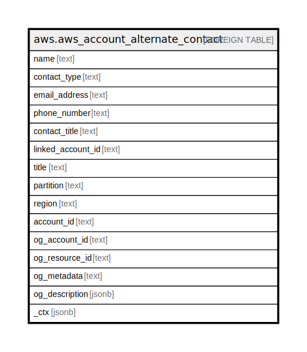

# aws.aws_account_alternate_contact

## Description

AWS Account Alternate Contact

## Columns

| Name | Type | Default | Nullable | Children | Parents | Comment |
| ---- | ---- | ------- | -------- | -------- | ------- | ------- |
| name | text |  | true |  |  | The name associated with this alternate contact. |
| contact_type | text |  | true |  |  | The type of alternate contact. |
| email_address | text |  | true |  |  | The email address associated with this alternate contact. |
| phone_number | text |  | true |  |  | The phone number associated with this alternate contact. |
| contact_title | text |  | true |  |  | The title associated with this alternate contact. |
| linked_account_id | text |  | true |  |  | Account ID to get alternate contact details for. |
| title | text |  | true |  |  | Title of the resource. |
| partition | text |  | true |  |  | The AWS partition in which the resource is located (aws, aws-cn, or aws-us-gov). |
| region | text |  | true |  |  | The AWS Region in which the resource is located. |
| account_id | text |  | true |  |  | The AWS Account ID in which the resource is located. |
| og_account_id | text |  | true |  |  | The Platform Account ID in which the resource is located. |
| og_resource_id | text |  | true |  |  | The unique ID of the resource in opengovernance. |
| og_metadata | text |  | true |  |  | Platform Metadata of the AWS resource. |
| og_description | jsonb |  | true |  |  | The full model description of the resource |
| _ctx | jsonb |  | true |  |  | Steampipe context in JSON form, e.g. connection_name. |

## Relations

---

> Generated by [tbls](https://github.com/k1LoW/tbls)
