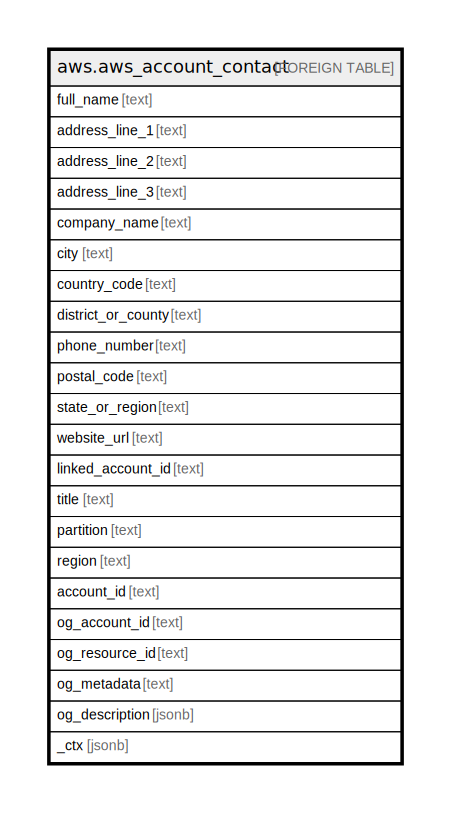

# aws.aws_account_contact

## Description

AWS Account Contact

## Columns

| Name | Type | Default | Nullable | Children | Parents | Comment |
| ---- | ---- | ------- | -------- | -------- | ------- | ------- |
| full_name | text |  | true |  |  | The full name of the primary contact address. |
| address_line_1 | text |  | true |  |  | The first line of the primary contact address |
| address_line_2 | text |  | true |  |  | The second line of the primary contact address, if any. |
| address_line_3 | text |  | true |  |  | The third line of the primary contact address, if any. |
| company_name | text |  | true |  |  | The name of the company associated with the primary contact information, if any. |
| city | text |  | true |  |  | The city of the primary contact address. |
| country_code | text |  | true |  |  | The ISO-3166 two-letter country code for the primary contact address. |
| district_or_county | text |  | true |  |  | The district or county of the primary contact address, if any. |
| phone_number | text |  | true |  |  | The phone number of the primary contact information. The number will be validated and, in some countries, checked for activation. |
| postal_code | text |  | true |  |  | The postal code of the primary contact address. |
| state_or_region | text |  | true |  |  | The state or region of the primary contact address. This field is required in selected countries. |
| website_url | text |  | true |  |  | The URL of the website associated with the primary contact information, if any. |
| linked_account_id | text |  | true |  |  | Account ID to get contact details for. |
| title | text |  | true |  |  | Title of the resource. |
| partition | text |  | true |  |  | The AWS partition in which the resource is located (aws, aws-cn, or aws-us-gov). |
| region | text |  | true |  |  | The AWS Region in which the resource is located. |
| account_id | text |  | true |  |  | The AWS Account ID in which the resource is located. |
| og_account_id | text |  | true |  |  | The Platform Account ID in which the resource is located. |
| og_resource_id | text |  | true |  |  | The unique ID of the resource in opengovernance. |
| og_metadata | text |  | true |  |  | Platform Metadata of the AWS resource. |
| og_description | jsonb |  | true |  |  | The full model description of the resource |
| _ctx | jsonb |  | true |  |  | Steampipe context in JSON form, e.g. connection_name. |

## Relations

---

> Generated by [tbls](https://github.com/k1LoW/tbls)
