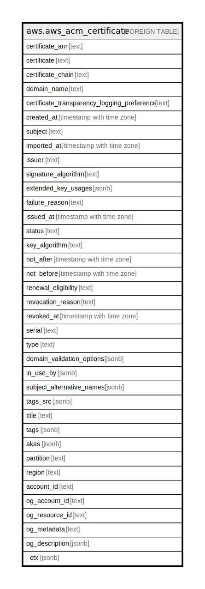

# aws.aws_acm_certificate

## Description

AWS ACM Certificate

## Columns

| Name | Type | Default | Nullable | Children | Parents | Comment |
| ---- | ---- | ------- | -------- | -------- | ------- | ------- |
| certificate_arn | text |  | true |  |  | Amazon Resource Name (ARN) of the certificate. This is of the form: arn:aws:acm:region:123456789012:certificate/12345678-1234-1234-1234-123456789012 |
| certificate | text |  | true |  |  | The ACM-issued certificate corresponding to the ARN specified as input |
| certificate_chain | text |  | true |  |  | The ACM-issued certificate corresponding to the ARN specified as input |
| domain_name | text |  | true |  |  | Fully qualified domain name (FQDN), such as www.example.com or example.com, for the certificate |
| certificate_transparency_logging_preference | text |  | true |  |  | Indicates whether to opt in to or out of certificate transparency logging. Certificates that are not logged typically generate a browser error. Transparency makes it possible for you to detect SSL/TLS certificates that have been mistakenly or maliciously issued for your domain. |
| created_at | timestamp with time zone |  | true |  |  | The time at which the certificate was requested. This value exists only when the certificate type is AMAZON_ISSUED |
| subject | text |  | true |  |  | The name of the entity that is associated with the public key contained in the certificate |
| imported_at | timestamp with time zone |  | true |  |  | The name of the certificate authority that issued and signed the certificate |
| issuer | text |  | true |  |  | The name of the certificate authority that issued and signed the certificate |
| signature_algorithm | text |  | true |  |  | The algorithm that was used to sign the certificate |
| extended_key_usages | jsonb |  | true |  |  | Specify one or more ExtendedKeyUsage extension values. |
| failure_reason | text |  | true |  |  | The reason the certificate request failed. This value exists only when the certificate status is FAILED |
| issued_at | timestamp with time zone |  | true |  |  | A list of ARNs for the AWS resources that are using the certificate. A certificate can be used by multiple AWS resources |
| status | text |  | true |  |  | The status of the certificate |
| key_algorithm | text |  | true |  |  | The algorithm that was used to generate the public-private key pair |
| not_after | timestamp with time zone |  | true |  |  | The time after which the certificate is not valid |
| not_before | timestamp with time zone |  | true |  |  | The time before which the certificate is not valid |
| renewal_eligibility | text |  | true |  |  | Specifies whether the certificate is eligible for renewal. |
| revocation_reason | text |  | true |  |  | The reason the certificate was revoked. This value exists only when the certificate status is REVOKED |
| revoked_at | timestamp with time zone |  | true |  |  | The time at which the certificate was revoked. This value exists only when the certificate status is REVOKED |
| serial | text |  | true |  |  | The serial number of the certificate |
| type | text |  | true |  |  | The source of the certificate. For certificates provided by ACM, this value is AMAZON_ISSUED. |
| domain_validation_options | jsonb |  | true |  |  | Contains information about the initial validation of each domain name that occurs as a result of the RequestCertificate request. This field exists only when the certificate type is AMAZON_ISSUED |
| in_use_by | jsonb |  | true |  |  | A list of ARNs for the AWS resources that are using the certificate |
| subject_alternative_names | jsonb |  | true |  |  | One or more domain names (subject alternative names) included in the certificate. This list contains the domain names that are bound to the public key that is contained in the certificate. The subject alternative names include the canonical domain name (CN) of the certificate and additional domain names that can be used to connect to the website |
| tags_src | jsonb |  | true |  |  | A list of tags associated with certificate |
| title | text |  | true |  |  | Title of the resource. |
| tags | jsonb |  | true |  |  | A map of tags for the resource. |
| akas | jsonb |  | true |  |  | Array of globally unique identifier strings (also known as) for the resource. |
| partition | text |  | true |  |  | The AWS partition in which the resource is located (aws, aws-cn, or aws-us-gov). |
| region | text |  | true |  |  | The AWS Region in which the resource is located. |
| account_id | text |  | true |  |  | The AWS Account ID in which the resource is located. |
| og_account_id | text |  | true |  |  | The Platform Account ID in which the resource is located. |
| og_resource_id | text |  | true |  |  | The unique ID of the resource in opengovernance. |
| og_metadata | text |  | true |  |  | Platform Metadata of the AWS resource. |
| og_description | jsonb |  | true |  |  | The full model description of the resource |
| _ctx | jsonb |  | true |  |  | Steampipe context in JSON form, e.g. connection_name. |

## Relations

---

> Generated by [tbls](https://github.com/k1LoW/tbls)
