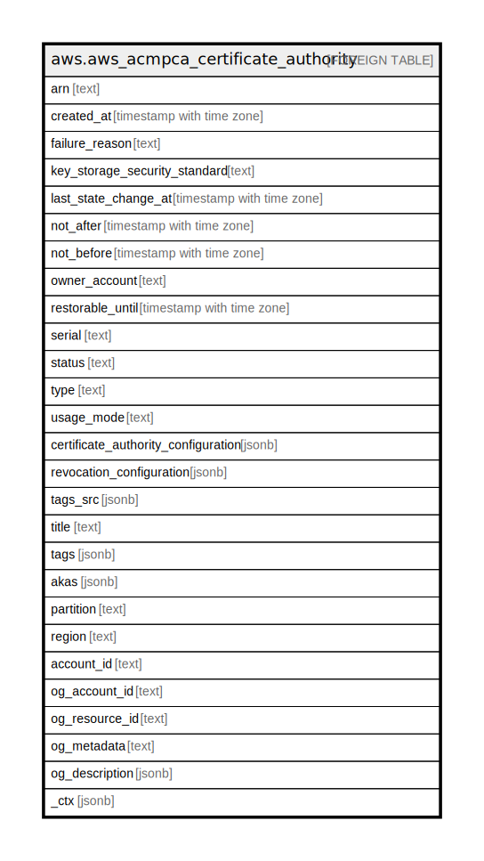

# aws.aws_acmpca_certificate_authority

## Description

AWS ACMPCA CertificateAuthority

## Columns

| Name | Type | Default | Nullable | Children | Parents | Comment |
| ---- | ---- | ------- | -------- | -------- | ------- | ------- |
| arn | text |  | true |  |  | Amazon Resource Name (ARN) for your private certificate authority (CA). The format is 12345678-1234-1234-1234-123456789012. |
| created_at | timestamp with time zone |  | true |  |  | Date and time at which your private CA was created. |
| failure_reason | text |  | true |  |  | Reason the request to create your private CA failed. |
| key_storage_security_standard | text |  | true |  |  | Defines a cryptographic key management compliance standard used for handling CA keys. Default: FIPS_140_2_LEVEL_3_OR_HIGHER Note: Amazon Web Services Region ap-northeast-3 supports only FIPS_140_2_LEVEL_2_OR_HIGHER. You must explicitly specify this parameter and value when creating a CA in that Region. Specifying a different value (or no value) results in an InvalidArgsException with the message 'A certificate authority cannot be created in this region with the specified security standard.' |
| last_state_change_at | timestamp with time zone |  | true |  |  | Date and time at which your private CA was last updated. |
| not_after | timestamp with time zone |  | true |  |  | Date and time after which your private CA certificate is not valid. |
| not_before | timestamp with time zone |  | true |  |  | Date and time before which your private CA certificate is not valid. |
| owner_account | text |  | true |  |  | The Amazon Web Services account ID that owns the certificate authority. |
| restorable_until | timestamp with time zone |  | true |  |  | The period during which a deleted CA can be restored. For more information, see the PermanentDeletionTimeInDays parameter of the DeleteCertificateAuthorityRequest action. |
| serial | text |  | true |  |  | Serial number of your private CA. |
| status | text |  | true |  |  | Status of your private CA. |
| type | text |  | true |  |  | Type of your private CA. |
| usage_mode | text |  | true |  |  | Specifies whether the CA issues general-purpose certificates that typically require a revocation mechanism, or short-lived certificates that may optionally omit revocation because they expire quickly. Short-lived certificate validity is limited to seven days. The default value is GENERAL_PURPOSE. |
| certificate_authority_configuration | jsonb |  | true |  |  | Your private CA configuration. |
| revocation_configuration | jsonb |  | true |  |  | Information about the Online Certificate Status Protocol (OCSP) configuration or certificate revocation list (CRL) created and maintained by your private CA. |
| tags_src | jsonb |  | true |  |  | A list of tags associated with private certificate authority (CA). |
| title | text |  | true |  |  | Title of the resource. |
| tags | jsonb |  | true |  |  | A map of tags for the resource. |
| akas | jsonb |  | true |  |  | Array of globally unique identifier strings (also known as) for the resource. |
| partition | text |  | true |  |  | The AWS partition in which the resource is located (aws, aws-cn, or aws-us-gov). |
| region | text |  | true |  |  | The AWS Region in which the resource is located. |
| account_id | text |  | true |  |  | The AWS Account ID in which the resource is located. |
| og_account_id | text |  | true |  |  | The Platform Account ID in which the resource is located. |
| og_resource_id | text |  | true |  |  | The unique ID of the resource in opengovernance. |
| og_metadata | text |  | true |  |  | Platform Metadata of the AWS resource. |
| og_description | jsonb |  | true |  |  | The full model description of the resource |
| _ctx | jsonb |  | true |  |  | Steampipe context in JSON form, e.g. connection_name. |

## Relations

---

> Generated by [tbls](https://github.com/k1LoW/tbls)
