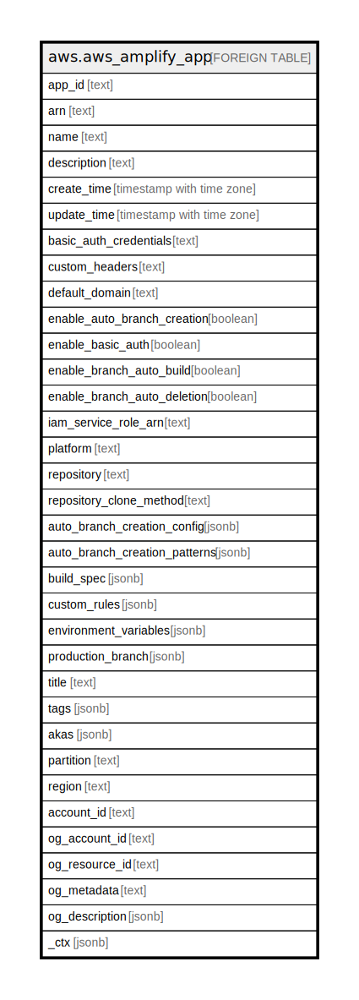

# aws.aws_amplify_app

## Description

AWS Amplify App

## Columns

| Name | Type | Default | Nullable | Children | Parents | Comment |
| ---- | ---- | ------- | -------- | -------- | ------- | ------- |
| app_id | text |  | true |  |  | The unique ID of the Amplify app. |
| arn | text |  | true |  |  | The Amazon Resource Name (ARN) of the Amplify app. |
| name | text |  | true |  |  | The name for the Amplify app. |
| description | text |  | true |  |  | The description for the Amplify app. |
| create_time | timestamp with time zone |  | true |  |  | Creates a date and time for the Amplify app. |
| update_time | timestamp with time zone |  | true |  |  | Updates the date and time for the Amplify app. |
| basic_auth_credentials | text |  | true |  |  | The basic authorization credentials for branches for the Amplify app. You must base64-encode the authorization credentials and provide them in the format user:password. |
| custom_headers | text |  | true |  |  | Describes the custom HTTP headers for the Amplify app. |
| default_domain | text |  | true |  |  | The default domain for the Amplify app. |
| enable_auto_branch_creation | boolean |  | true |  |  | Enables automated branch creation for the Amplify app. |
| enable_basic_auth | boolean |  | true |  |  | Enables basic authorization for the Amplify app's branches. |
| enable_branch_auto_build | boolean |  | true |  |  | Enables the auto-building of branches for the Amplify app. |
| enable_branch_auto_deletion | boolean |  | true |  |  | Automatically disconnect a branch in the Amplify Console when you delete a branch from your Git repository. |
| iam_service_role_arn | text |  | true |  |  | The AWS Identity and Access Management (IAM) service role for the Amazon Resource Name (ARN) of the Amplify app. |
| platform | text |  | true |  |  | The platform for the Amplify app. |
| repository | text |  | true |  |  | The Git repository for the Amplify app. |
| repository_clone_method | text |  | true |  |  | The Amplify service uses this parameter to specify the authentication protocol to use to access the Git repository for an Amplify app. Amplify specifies TOKEN for a GitHub repository, SIGV4 for an AWS CodeCommit repository, and SSH for GitLab and Bitbucket repositories. |
| auto_branch_creation_config | jsonb |  | true |  |  | Describes the automated branch creation configuration for the Amplify app. |
| auto_branch_creation_patterns | jsonb |  | true |  |  | Describes the automated branch creation glob patterns for the Amplify app. |
| build_spec | jsonb |  | true |  |  | Describes the content of the build specification (build spec) for the Amplify app. |
| custom_rules | jsonb |  | true |  |  | Describes the custom redirect and rewrite rules for the Amplify app. |
| environment_variables | jsonb |  | true |  |  | The environment variables for the Amplify app. |
| production_branch | jsonb |  | true |  |  | Describes the information about a production branch of the Amplify app. |
| title | text |  | true |  |  | Title of the resource. |
| tags | jsonb |  | true |  |  | A map of tags for the resource. |
| akas | jsonb |  | true |  |  | Array of globally unique identifier strings (also known as) for the resource. |
| partition | text |  | true |  |  | The AWS partition in which the resource is located (aws, aws-cn, or aws-us-gov). |
| region | text |  | true |  |  | The AWS Region in which the resource is located. |
| account_id | text |  | true |  |  | The AWS Account ID in which the resource is located. |
| og_account_id | text |  | true |  |  | The Platform Account ID in which the resource is located. |
| og_resource_id | text |  | true |  |  | The unique ID of the resource in opengovernance. |
| og_metadata | text |  | true |  |  | Platform Metadata of the AWS resource. |
| og_description | jsonb |  | true |  |  | The full model description of the resource |
| _ctx | jsonb |  | true |  |  | Steampipe context in JSON form, e.g. connection_name. |

## Relations

---

> Generated by [tbls](https://github.com/k1LoW/tbls)
