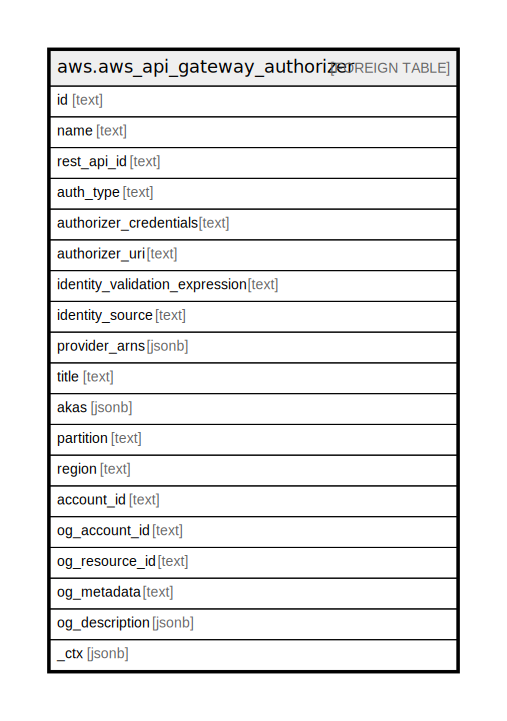

# aws.aws_api_gateway_authorizer

## Description

AWS API Gateway Authorizer

## Columns

| Name | Type | Default | Nullable | Children | Parents | Comment |
| ---- | ---- | ------- | -------- | -------- | ------- | ------- |
| id | text |  | true |  |  | The identifier for the authorizer resource |
| name | text |  | true |  |  | The name of the authorizer |
| rest_api_id | text |  | true |  |  | The id of the rest api |
| auth_type | text |  | true |  |  | Optional customer-defined field, used in OpenAPI imports and exports without functional impact |
| authorizer_credentials | text |  | true |  |  | Specifies the required credentials as an IAM role for API Gateway to invoke the authorizer |
| authorizer_uri | text |  | true |  |  | Specifies the authorizer's Uniform Resource Identifier (URI). For TOKEN or REQUEST authorizers, this must be a well-formed Lambda function URI |
| identity_validation_expression | text |  | true |  |  | A validation expression for the incoming identity token. For TOKEN authorizers, this value is a regular expression |
| identity_source | text |  | true |  |  | The identity source for which authorization is requested |
| provider_arns | jsonb |  | true |  |  | A list of the Amazon Cognito user pool ARNs for the COGNITO_USER_POOLS authorizer |
| title | text |  | true |  |  | Title of the resource. |
| akas | jsonb |  | true |  |  | Array of globally unique identifier strings (also known as) for the resource. |
| partition | text |  | true |  |  | The AWS partition in which the resource is located (aws, aws-cn, or aws-us-gov). |
| region | text |  | true |  |  | The AWS Region in which the resource is located. |
| account_id | text |  | true |  |  | The AWS Account ID in which the resource is located. |
| og_account_id | text |  | true |  |  | The Platform Account ID in which the resource is located. |
| og_resource_id | text |  | true |  |  | The unique ID of the resource in opengovernance. |
| og_metadata | text |  | true |  |  | Platform Metadata of the AWS resource. |
| og_description | jsonb |  | true |  |  | The full model description of the resource |
| _ctx | jsonb |  | true |  |  | Steampipe context in JSON form, e.g. connection_name. |

## Relations

---

> Generated by [tbls](https://github.com/k1LoW/tbls)
