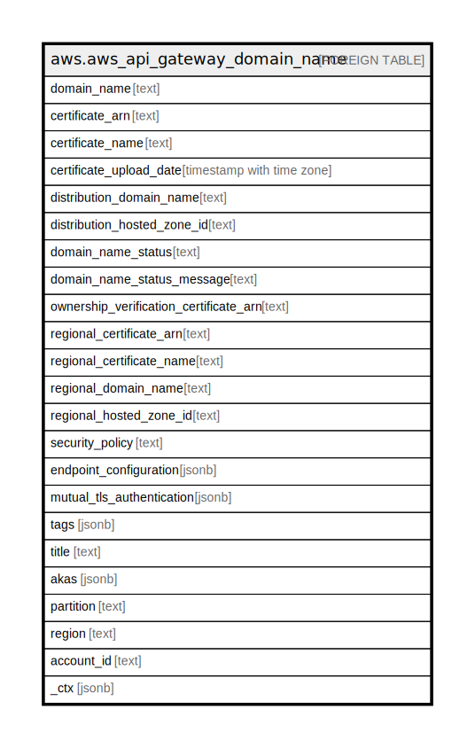

# aws.aws_api_gateway_domain_name

## Description

AWS API Gateway Domain Name

## Columns

| Name | Type | Default | Nullable | Children | Parents | Comment |
| ---- | ---- | ------- | -------- | -------- | ------- | ------- |
| domain_name | text |  | true |  |  | The custom domain name as an API host name. |
| certificate_arn | text |  | true |  |  | The reference to an AWS-managed certificate that will be used by edge-optimized endpoint for this domain name. |
| certificate_name | text |  | true |  |  | The name of the certificate that will be used by edge-optimized endpoint for this domain name. |
| certificate_upload_date | timestamp with time zone |  | true |  |  | The timestamp when the certificate that was used by edge-optimized endpoint for this domain name was uploaded. |
| distribution_domain_name | text |  | true |  |  | The domain name of the Amazon CloudFront distribution associated with this custom domain name for an edge-optimized endpoint. |
| distribution_hosted_zone_id | text |  | true |  |  | The region-agnostic Amazon Route 53 Hosted Zone ID of the edge-optimized endpoint. The valid value is Z2FDTNDATAQYW2 for all the regions. |
| domain_name_status | text |  | true |  |  | The status of the DomainName migration. The valid values are AVAILABLE and UPDATING. If the status is UPDATING, the domain cannot be modified further until the existing operation is complete. |
| domain_name_status_message | text |  | true |  |  | An optional text message containing detailed information about status of the DomainName migration. |
| ownership_verification_certificate_arn | text |  | true |  |  | The ARN of the public certificate issued by ACM to validate ownership of your custom domain. Only required when configuring mutual TLS and using an ACM imported or private CA certificate ARN as the regionalCertificateArn. |
| regional_certificate_arn | text |  | true |  |  | The reference to an AWS-managed certificate that will be used for validating the regional domain name. AWS Certificate Manager is the only supported source. |
| regional_certificate_name | text |  | true |  |  | The name of the certificate that will be used for validating the regional domain name. |
| regional_domain_name | text |  | true |  |  | The domain name associated with the regional endpoint for this custom domain name. You set up this association by adding a DNS record that points the custom domain name to this regional domain name. The regional domain name is returned by API Gateway when you create a regional endpoint. |
| regional_hosted_zone_id | text |  | true |  |  | The region-specific Amazon Route 53 Hosted Zone ID of the regional endpoint. For more information, see Set up a Regional Custom Domain Name and AWS Regions and Endpoints for API Gateway. |
| security_policy | text |  | true |  |  | The Transport Layer Security (TLS) version + cipher suite for this DomainName. The valid values are TLS_1_0 and TLS_1_2. |
| endpoint_configuration | jsonb |  | true |  |  | The endpoint configuration of this DomainName showing the endpoint types of the domain name. |
| mutual_tls_authentication | jsonb |  | true |  |  | The mutual TLS authentication configuration for a custom domain name. If specified, API Gateway performs two-way authentication between the client and the server. Clients must present a trusted certificate to access your API. |
| tags | jsonb |  | true |  |  | A map of tags for the resource. |
| title | text |  | true |  |  | Title of the resource. |
| akas | jsonb |  | true |  |  | Array of globally unique identifier strings (also known as) for the resource. |
| partition | text |  | true |  |  | The AWS partition in which the resource is located (aws, aws-cn, or aws-us-gov). |
| region | text |  | true |  |  | The AWS Region in which the resource is located. |
| account_id | text |  | true |  |  | The AWS Account ID in which the resource is located. |
| _ctx | jsonb |  | true |  |  | Steampipe context in JSON form, e.g. connection_name. |

## Relations

---

> Generated by [tbls](https://github.com/k1LoW/tbls)
