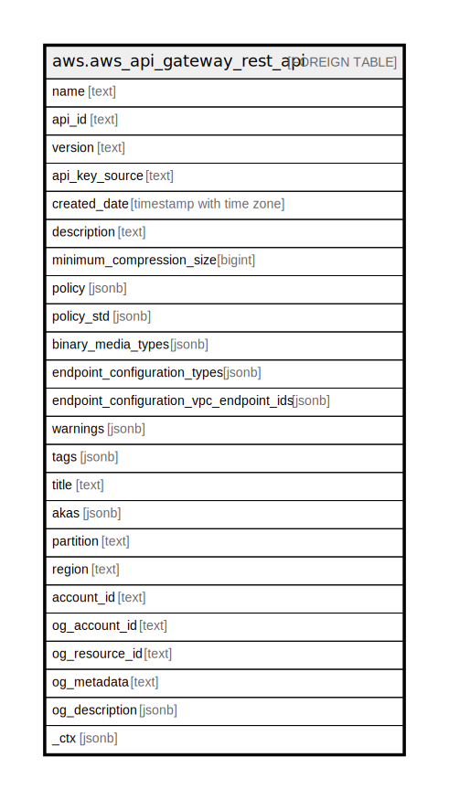

# aws.aws_api_gateway_rest_api

## Description

AWS API Gateway Rest API 

## Columns

| Name | Type | Default | Nullable | Children | Parents | Comment |
| ---- | ---- | ------- | -------- | -------- | ------- | ------- |
| name | text |  | true |  |  | The API's name |
| api_id | text |  | true |  |  | The API's identifier. This identifier is unique across all of APIs in API Gateway |
| version | text |  | true |  |  | A version identifier for the API |
| api_key_source | text |  | true |  |  | The source of the API key for metering requests according to a usage plan |
| created_date | timestamp with time zone |  | true |  |  | The timestamp when the API was created |
| description | text |  | true |  |  | The API's description |
| minimum_compression_size | bigint |  | true |  |  | A nullable integer that is used to enable compression (with non-negative between 0 and 10485760 (10M) bytes, inclusive) or disable compression (with a null value) on an API. When compression is enabled, compression or decompression is not applied on the payload if the payload size is smaller than this value |
| policy | jsonb |  | true |  |  | A stringified JSON policy document that applies to this RestApi regardless of the caller and Method configuration |
| policy_std | jsonb |  | true |  |  | Contains the policy in a canonical form for easier searching. |
| binary_media_types | jsonb |  | true |  |  | The list of binary media types supported by the RestApi. By default, the RestApi supports only UTF-8-encoded text payloads |
| endpoint_configuration_types | jsonb |  | true |  |  | The endpoint configuration of this RestApi showing the endpoint types of the API |
| endpoint_configuration_vpc_endpoint_ids | jsonb |  | true |  |  | The endpoint configuration of this RestApi showing the endpoint types of the API |
| warnings | jsonb |  | true |  |  | The warning messages reported when failonwarnings is turned on during API import |
| tags | jsonb |  | true |  |  | A map of tags for the resource. |
| title | text |  | true |  |  | Title of the resource. |
| akas | jsonb |  | true |  |  | Array of globally unique identifier strings (also known as) for the resource. |
| partition | text |  | true |  |  | The AWS partition in which the resource is located (aws, aws-cn, or aws-us-gov). |
| region | text |  | true |  |  | The AWS Region in which the resource is located. |
| account_id | text |  | true |  |  | The AWS Account ID in which the resource is located. |
| og_account_id | text |  | true |  |  | The Platform Account ID in which the resource is located. |
| og_resource_id | text |  | true |  |  | The unique ID of the resource in opengovernance. |
| og_metadata | text |  | true |  |  | Platform Metadata of the AWS resource. |
| og_description | jsonb |  | true |  |  | The full model description of the resource |
| _ctx | jsonb |  | true |  |  | Steampipe context in JSON form, e.g. connection_name. |

## Relations

---

> Generated by [tbls](https://github.com/k1LoW/tbls)
