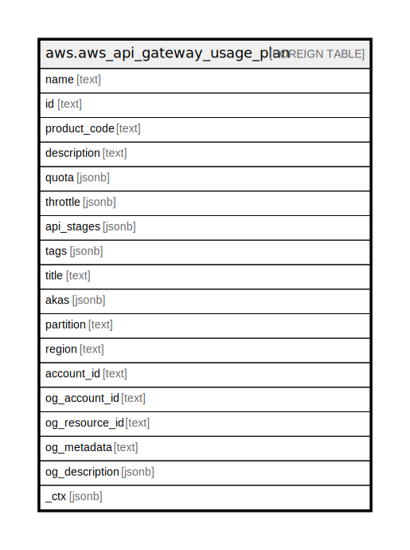

# aws.aws_api_gateway_usage_plan

## Description

AWS API Gateway Usage Plan

## Columns

| Name | Type | Default | Nullable | Children | Parents | Comment |
| ---- | ---- | ------- | -------- | -------- | ------- | ------- |
| name | text |  | true |  |  | The name of a usage plan |
| id | text |  | true |  |  | The identifier of a UsagePlan resource |
| product_code | text |  | true |  |  | The AWS Markeplace product identifier to associate with the usage plan as a SaaS product on AWS Marketplace |
| description | text |  | true |  |  | The description of a usage plan |
| quota | jsonb |  | true |  |  | The maximum number of permitted requests per a given unit time interval |
| throttle | jsonb |  | true |  |  | The request throttle limits of a usage plan |
| api_stages | jsonb |  | true |  |  | The associated API stages of a usage plan |
| tags | jsonb |  | true |  |  | A map of tags for the resource. |
| title | text |  | true |  |  | Title of the resource. |
| akas | jsonb |  | true |  |  | Array of globally unique identifier strings (also known as) for the resource. |
| partition | text |  | true |  |  | The AWS partition in which the resource is located (aws, aws-cn, or aws-us-gov). |
| region | text |  | true |  |  | The AWS Region in which the resource is located. |
| account_id | text |  | true |  |  | The AWS Account ID in which the resource is located. |
| og_account_id | text |  | true |  |  | The Platform Account ID in which the resource is located. |
| og_resource_id | text |  | true |  |  | The unique ID of the resource in opengovernance. |
| og_metadata | text |  | true |  |  | Platform Metadata of the AWS resource. |
| og_description | jsonb |  | true |  |  | The full model description of the resource |
| _ctx | jsonb |  | true |  |  | Steampipe context in JSON form, e.g. connection_name. |

## Relations

---

> Generated by [tbls](https://github.com/k1LoW/tbls)
