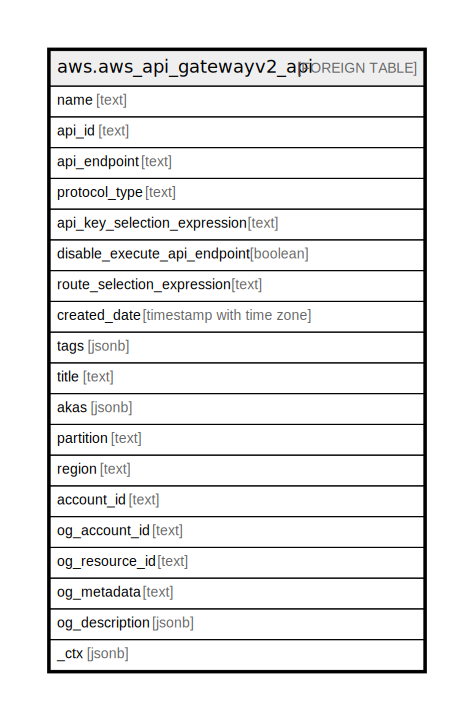

# aws.aws_api_gatewayv2_api

## Description

AWS API Gateway Version 2 API

## Columns

| Name | Type | Default | Nullable | Children | Parents | Comment |
| ---- | ---- | ------- | -------- | -------- | ------- | ------- |
| name | text |  | true |  |  | The name of the API |
| api_id | text |  | true |  |  | The API ID |
| api_endpoint | text |  | true |  |  | The URI of the API, of the form {api-id}.execute-api.{region}.amazonaws.com |
| protocol_type | text |  | true |  |  | The API protocol |
| api_key_selection_expression | text |  | true |  |  | An API key selection expression. Supported only for WebSocket APIs |
| disable_execute_api_endpoint | boolean |  | true |  |  | Specifies whether clients can invoke your API by using the default execute-api endpoint. |
| route_selection_expression | text |  | true |  |  | The route selection expression for the API. For HTTP APIs, the routeSelectionExpression must be ${request.method} ${request.path}. If not provided, this will be the default for HTTP APIs |
| created_date | timestamp with time zone |  | true |  |  | The timestamp when the API was created |
| tags | jsonb |  | true |  |  | A map of tags for the resource. |
| title | text |  | true |  |  | Title of the resource. |
| akas | jsonb |  | true |  |  | Array of globally unique identifier strings (also known as) for the resource. |
| partition | text |  | true |  |  | The AWS partition in which the resource is located (aws, aws-cn, or aws-us-gov). |
| region | text |  | true |  |  | The AWS Region in which the resource is located. |
| account_id | text |  | true |  |  | The AWS Account ID in which the resource is located. |
| og_account_id | text |  | true |  |  | The Platform Account ID in which the resource is located. |
| og_resource_id | text |  | true |  |  | The unique ID of the resource in opengovernance. |
| og_metadata | text |  | true |  |  | Platform Metadata of the AWS resource. |
| og_description | jsonb |  | true |  |  | The full model description of the resource |
| _ctx | jsonb |  | true |  |  | Steampipe context in JSON form, e.g. connection_name. |

## Relations

---

> Generated by [tbls](https://github.com/k1LoW/tbls)
