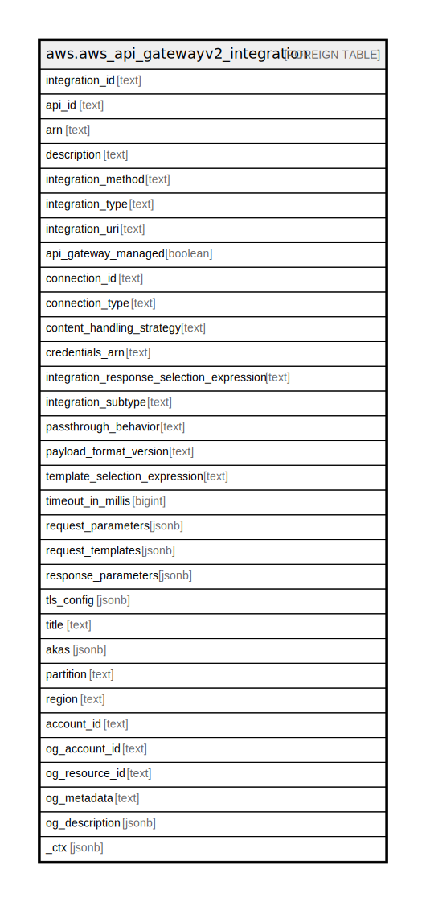

# aws.aws_api_gatewayv2_integration

## Description

AWS API Gateway Version 2 Integration

## Columns

| Name | Type | Default | Nullable | Children | Parents | Comment |
| ---- | ---- | ------- | -------- | -------- | ------- | ------- |
| integration_id | text |  | true |  |  | Represents the identifier of an integration. |
| api_id | text |  | true |  |  | Represents the identifier of an API. |
| arn | text |  | true |  |  | The Amazon Resource Name (ARN) specifying the integration. |
| description | text |  | true |  |  | Represents the description of an integration. |
| integration_method | text |  | true |  |  | Specifies the integration's HTTP method type. |
| integration_type | text |  | true |  |  | Represents an API method integration type. |
| integration_uri | text |  | true |  |  | A string representation of a URI with a length between [1-2048]. For a Lambda integration, specify the URI of a Lambda function. For an HTTP integration, specify a fully-qualified URL. |
| api_gateway_managed | boolean |  | true |  |  | Specifies whether an integration is managed by API Gateway. If you created an API using using quick create, the resulting integration is managed by API Gateway. You can update a managed integration, but you can't delete it. |
| connection_id | text |  | true |  |  | The ID of the VPC link for a private integration. Supported only for HTTP APIs. |
| connection_type | text |  | true |  |  | Represents a connection type. |
| content_handling_strategy | text |  | true |  |  | Specifies how to handle response payload content type conversions. Supported only for WebSocket APIs. |
| credentials_arn | text |  | true |  |  | Specifies the credentials required for the integration, if any. For AWS integrations, three options are available. To specify an IAM Role for API Gateway to assume, use the role's Amazon Resource Name (ARN). |
| integration_response_selection_expression | text |  | true |  |  | An expression used to extract information at runtime. See Selection Expressions(https://docs.aws.amazon.com/apigateway/latest/developerguide/apigateway-websocket-api-selection-expressions.html#apigateway-websocket-api-apikey-selection-expressions for more information. |
| integration_subtype | text |  | true |  |  | A string with a length between [1-128]. |
| passthrough_behavior | text |  | true |  |  | Represents passthrough behavior for an integration response. Supported only for WebSocket APIs. |
| payload_format_version | text |  | true |  |  | Specifies the format of the payload sent to an integration. Required for HTTP APIs. |
| template_selection_expression | text |  | true |  |  | The template selection expression for the integration. Supported only for WebSocket APIs. |
| timeout_in_millis | bigint |  | true |  |  | Indicates custom timeout between 50 and 29,000 milliseconds for WebSocket APIs and between 50 and 30,000 milliseconds for HTTP APIs. The default timeout is 29 seconds for WebSocket APIs and 30 seconds for HTTP APIs. |
| request_parameters | jsonb |  | true |  |  | For HTTP API itegrations, without a specified integrationSubtype request parameters are a key-value map specifying how to transform HTTP requests before sending them to backend integrations. The key should follow the pattern <action>:<header|querystring|path>.<location>. The action can be append, overwrite or remove. For values, you can provide static values, or map request data, stage variables, or context variables that are evaluated at runtime. To learn more, see Transforming API requests and responses (https://docs.aws.amazon.com/apigateway/latest/developerguide/http-api-parameter-mapping.html). |
| request_templates | jsonb |  | true |  |  | Represents a map of Velocity templates that are applied on the request payload based on the value of the Content-Type header sent by the client. The content type value is the key in this map, and the template (as a String) is the value. Supported only for WebSocket APIs. |
| response_parameters | jsonb |  | true |  |  | API requests and responses (https://docs.aws.amazon.com/apigateway/latest/developerguide/http-api-parameter-mapping.html). |
| tls_config | jsonb |  | true |  |  | The TLS configuration for a private integration. If you specify a TLS configuration, private integration traffic uses the HTTPS protocol. Supported only for HTTP APIs. |
| title | text |  | true |  |  | Title of the resource. |
| akas | jsonb |  | true |  |  | Array of globally unique identifier strings (also known as) for the resource. |
| partition | text |  | true |  |  | The AWS partition in which the resource is located (aws, aws-cn, or aws-us-gov). |
| region | text |  | true |  |  | The AWS Region in which the resource is located. |
| account_id | text |  | true |  |  | The AWS Account ID in which the resource is located. |
| og_account_id | text |  | true |  |  | The Platform Account ID in which the resource is located. |
| og_resource_id | text |  | true |  |  | The unique ID of the resource in opengovernance. |
| og_metadata | text |  | true |  |  | Platform Metadata of the AWS resource. |
| og_description | jsonb |  | true |  |  | The full model description of the resource |
| _ctx | jsonb |  | true |  |  | Steampipe context in JSON form, e.g. connection_name. |

## Relations

---

> Generated by [tbls](https://github.com/k1LoW/tbls)
