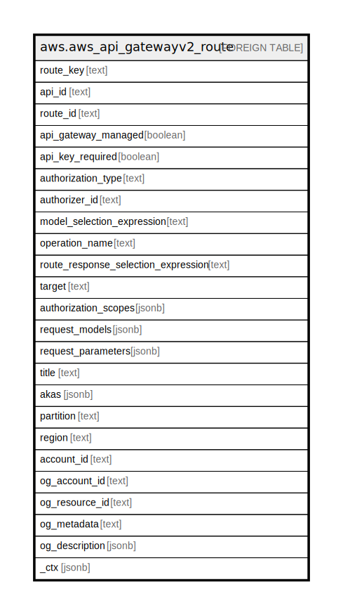

# aws.aws_api_gatewayv2_route

## Description

AWS API Gateway Version 2 Route

## Columns

| Name | Type | Default | Nullable | Children | Parents | Comment |
| ---- | ---- | ------- | -------- | -------- | ------- | ------- |
| route_key | text |  | true |  |  | The route key for the route. |
| api_id | text |  | true |  |  | Represents the identifier of an API. |
| route_id | text |  | true |  |  | The route ID. |
| api_gateway_managed | boolean |  | true |  |  | Specifies whether a route is managed by API Gateway. |
| api_key_required | boolean |  | true |  |  | Specifies whether an API key is required for this route. Supported only for WebSocket APIs. |
| authorization_type | text |  | true |  |  | The authorization type for the route. For WebSocket APIs, valid values are NONE for open access, AWS_IAM for using AWS IAM permissions, and CUSTOM for using a Lambda authorizer For HTTP APIs, valid values are NONE for open access, JWT for using JSON Web Tokens, AWS_IAM for using AWS IAM permissions, and CUSTOM for using a Lambda authorizer. |
| authorizer_id | text |  | true |  |  | The identifier of the Authorizer resource to be associated with this route. The authorizer identifier is generated by API Gateway when you created the authorizer. |
| model_selection_expression | text |  | true |  |  | The model selection expression for the route. Supported only for WebSocket APIs. |
| operation_name | text |  | true |  |  | The operation name for the route. |
| route_response_selection_expression | text |  | true |  |  | The route response selection expression for the route. Supported only for WebSocket APIs. |
| target | text |  | true |  |  | The target for the route. |
| authorization_scopes | jsonb |  | true |  |  | A list of authorization scopes configured on a route. The scopes are used with a JWT authorizer to authorize the method invocation. The authorization works by matching the route scopes against the scopes parsed from the access token in the incoming request. The method invocation is authorized if any route scope matches a claimed scope in the access token. Otherwise, the invocation is not authorized. When the route scope is configured, the client must provide an access token instead of an identity token for authorization purposes. |
| request_models | jsonb |  | true |  |  | The request models for the route. Supported only for WebSocket APIs. |
| request_parameters | jsonb |  | true |  |  | The request parameters for the route. Supported only for WebSocket APIs. |
| title | text |  | true |  |  | Title of the resource. |
| akas | jsonb |  | true |  |  | Array of globally unique identifier strings (also known as) for the resource. |
| partition | text |  | true |  |  | The AWS partition in which the resource is located (aws, aws-cn, or aws-us-gov). |
| region | text |  | true |  |  | The AWS Region in which the resource is located. |
| account_id | text |  | true |  |  | The AWS Account ID in which the resource is located. |
| og_account_id | text |  | true |  |  | The Platform Account ID in which the resource is located. |
| og_resource_id | text |  | true |  |  | The unique ID of the resource in opengovernance. |
| og_metadata | text |  | true |  |  | Platform Metadata of the AWS resource. |
| og_description | jsonb |  | true |  |  | The full model description of the resource |
| _ctx | jsonb |  | true |  |  | Steampipe context in JSON form, e.g. connection_name. |

## Relations

---

> Generated by [tbls](https://github.com/k1LoW/tbls)
