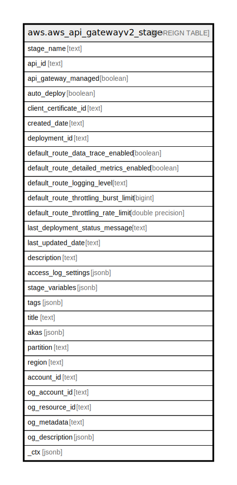

# aws.aws_api_gatewayv2_stage

## Description

AWS API Gateway Version 2 Stage

## Columns

| Name | Type | Default | Nullable | Children | Parents | Comment |
| ---- | ---- | ------- | -------- | -------- | ------- | ------- |
| stage_name | text |  | true |  |  | The name of the stage |
| api_id | text |  | true |  |  | The id of the api which contains this stage |
| api_gateway_managed | boolean |  | true |  |  | Specifies whether a stage is managed by API Gateway |
| auto_deploy | boolean |  | true |  |  | Specifies whether updates to an API automatically trigger a new deployment |
| client_certificate_id | text |  | true |  |  | The identifier of a client certificate for a Stage. Supported only for WebSocket APIs |
| created_date | text |  | true |  |  | The timestamp when the stage was created |
| deployment_id | text |  | true |  |  | The identifier of the Deployment that the Stage is associated with |
| default_route_data_trace_enabled | boolean |  | true |  |  | Specifies whether (true) or not (false) data trace logging is enabled for this route. This property affects the log entries pushed to Amazon CloudWatch Logs. Supported only for WebSocket APIs |
| default_route_detailed_metrics_enabled | boolean |  | true |  |  | Specifies whether detailed metrics are enabled |
| default_route_logging_level | text |  | true |  |  | Specifies the logging level for this route: INFO, ERROR, or OFF. This property affects the log entries pushed to Amazon CloudWatch Logs. Supported only for WebSocket APIs |
| default_route_throttling_burst_limit | bigint |  | true |  |  | Throttling burst limit for default route settings |
| default_route_throttling_rate_limit | double precision |  | true |  |  | Throttling rate limit for default route settings |
| last_deployment_status_message | text |  | true |  |  | Describes the status of the last deployment of a stage. Supported only for stages with autoDeploy enabled |
| last_updated_date | text |  | true |  |  | The timestamp when the stage was last updated |
| description | text |  | true |  |  | The stage's description |
| access_log_settings | jsonb |  | true |  |  | Access log settings of the stage. |
| stage_variables | jsonb |  | true |  |  | A map that defines the stage variables for a stage resource |
| tags | jsonb |  | true |  |  | A map of tags for the resource. |
| title | text |  | true |  |  | Title of the resource. |
| akas | jsonb |  | true |  |  | Array of globally unique identifier strings (also known as) for the resource. |
| partition | text |  | true |  |  | The AWS partition in which the resource is located (aws, aws-cn, or aws-us-gov). |
| region | text |  | true |  |  | The AWS Region in which the resource is located. |
| account_id | text |  | true |  |  | The AWS Account ID in which the resource is located. |
| og_account_id | text |  | true |  |  | The Platform Account ID in which the resource is located. |
| og_resource_id | text |  | true |  |  | The unique ID of the resource in opengovernance. |
| og_metadata | text |  | true |  |  | Platform Metadata of the AWS resource. |
| og_description | jsonb |  | true |  |  | The full model description of the resource |
| _ctx | jsonb |  | true |  |  | Steampipe context in JSON form, e.g. connection_name. |

## Relations

---

> Generated by [tbls](https://github.com/k1LoW/tbls)
