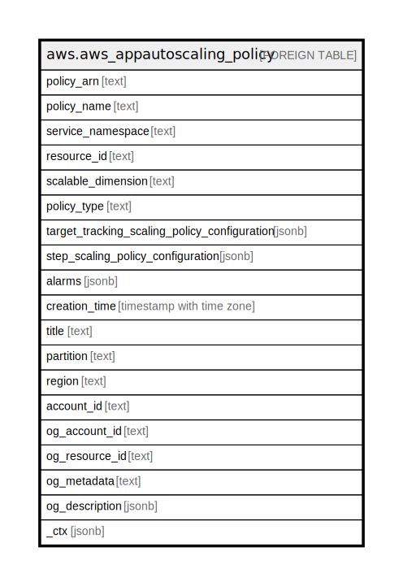

# aws.aws_appautoscaling_policy

## Description

AWS Application Auto Scaling Policy

## Columns

| Name | Type | Default | Nullable | Children | Parents | Comment |
| ---- | ---- | ------- | -------- | -------- | ------- | ------- |
| policy_arn | text |  | true |  |  | The Amazon Resource Name (ARN) of the appautoscaling policy. |
| policy_name | text |  | true |  |  | The name of the scaling policy. |
| service_namespace | text |  | true |  |  | The namespace of the AWS service that provides the resource, or a custom-resource. |
| resource_id | text |  | true |  |  | The identifier of the resource associated with the scaling policy. |
| scalable_dimension | text |  | true |  |  | The scalable dimension associated with the scaling policy. This string consists of the service namespace, resource type, and scaling property. |
| policy_type | text |  | true |  |  | The policy type. Currently supported values are TargetTrackingScaling and StepScaling |
| target_tracking_scaling_policy_configuration | jsonb |  | true |  |  | The target tracking scaling policy configuration (if policy type is TargetTrackingScaling). |
| step_scaling_policy_configuration | jsonb |  | true |  |  | The step tracking scaling policy configuration (if policy type is StepScaling). |
| alarms | jsonb |  | true |  |  | The CloudWatch alarms associated with the scaling policy. |
| creation_time | timestamp with time zone |  | true |  |  | The Unix timestamp for when the scaling policy was created. |
| title | text |  | true |  |  | Title of the resource. |
| partition | text |  | true |  |  | The AWS partition in which the resource is located (aws, aws-cn, or aws-us-gov). |
| region | text |  | true |  |  | The AWS Region in which the resource is located. |
| account_id | text |  | true |  |  | The AWS Account ID in which the resource is located. |
| og_account_id | text |  | true |  |  | The Platform Account ID in which the resource is located. |
| og_resource_id | text |  | true |  |  | The unique ID of the resource in opengovernance. |
| og_metadata | text |  | true |  |  | Platform Metadata of the AWS resource. |
| og_description | jsonb |  | true |  |  | The full model description of the resource |
| _ctx | jsonb |  | true |  |  | Steampipe context in JSON form, e.g. connection_name. |

## Relations

---

> Generated by [tbls](https://github.com/k1LoW/tbls)
