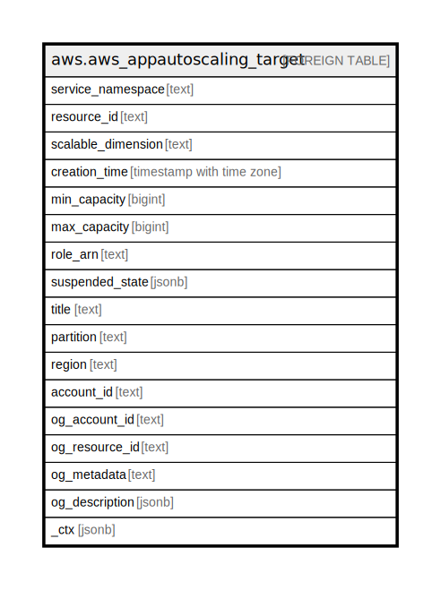

# aws.aws_appautoscaling_target

## Description

AWS Application Auto Scaling Target

## Columns

| Name | Type | Default | Nullable | Children | Parents | Comment |
| ---- | ---- | ------- | -------- | -------- | ------- | ------- |
| service_namespace | text |  | true |  |  | The namespace of the AWS service that provides the resource, or a custom-resource. |
| resource_id | text |  | true |  |  | The identifier of the resource associated with the scalable target. |
| scalable_dimension | text |  | true |  |  | The scalable dimension associated with the scalable target. This string consists of the service namespace, resource type, and scaling property. |
| creation_time | timestamp with time zone |  | true |  |  | The Unix timestamp for when the scalable target was created. |
| min_capacity | bigint |  | true |  |  | The minimum value to scale to in response to a scale-in activity. |
| max_capacity | bigint |  | true |  |  | The maximum value to scale to in response to a scale-out activity. |
| role_arn | text |  | true |  |  | The ARN of an IAM role that allows Application Auto Scaling to modify the scalable target on your behalf. |
| suspended_state | jsonb |  | true |  |  | Specifies whether the scaling activities for a scalable target are in a suspended state. |
| title | text |  | true |  |  | Title of the resource. |
| partition | text |  | true |  |  | The AWS partition in which the resource is located (aws, aws-cn, or aws-us-gov). |
| region | text |  | true |  |  | The AWS Region in which the resource is located. |
| account_id | text |  | true |  |  | The AWS Account ID in which the resource is located. |
| og_account_id | text |  | true |  |  | The Platform Account ID in which the resource is located. |
| og_resource_id | text |  | true |  |  | The unique ID of the resource in opengovernance. |
| og_metadata | text |  | true |  |  | Platform Metadata of the AWS resource. |
| og_description | jsonb |  | true |  |  | The full model description of the resource |
| _ctx | jsonb |  | true |  |  | Steampipe context in JSON form, e.g. connection_name. |

## Relations

---

> Generated by [tbls](https://github.com/k1LoW/tbls)
