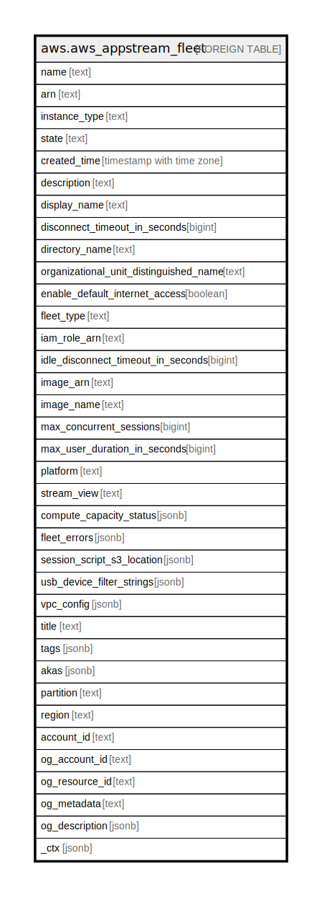

# aws.aws_appstream_fleet

## Description

AWS AppStream Fleet

## Columns

| Name | Type | Default | Nullable | Children | Parents | Comment |
| ---- | ---- | ------- | -------- | -------- | ------- | ------- |
| name | text |  | true |  |  | The name of the fleet. |
| arn | text |  | true |  |  | The Amazon Resource Name (ARN) for the fleet. |
| instance_type | text |  | true |  |  | The instance type to use when launching fleet instances. |
| state | text |  | true |  |  | The current state for the fleet. |
| created_time | timestamp with time zone |  | true |  |  | The time the fleet was created. |
| description | text |  | true |  |  | The description to display. |
| display_name | text |  | true |  |  | The fleet name to display. |
| disconnect_timeout_in_seconds | bigint |  | true |  |  | The amount of time that a streaming session remains active after users disconnect. If they try to reconnect to the streaming session after a disconnection or network interruption within this time interval, they are connected to their previous session. Otherwise, they are connected to a new session with a new streaming instance. Specify a value between 60 and 360000. |
| directory_name | text |  | true |  |  | The fully qualified name of the directory (for example, corp.example.com). |
| organizational_unit_distinguished_name | text |  | true |  |  | The distinguished name of the organizational unit for computer accounts. |
| enable_default_internet_access | boolean |  | true |  |  | Indicates whether default internet access is enabled for the fleet. |
| fleet_type | text |  | true |  |  | The fleet type. ALWAYS_ON Provides users with instant-on access to their apps. You are charged for all running instances in your fleet, even if no users are streaming apps. ON_DEMAND Provide users with access to applications after they connect, which takes one to two minutes. You are charged for instance streaming when users are connected and a small hourly fee for instances that are not streaming apps. |
| iam_role_arn | text |  | true |  |  | The ARN of the IAM role that is applied to the fleet. |
| idle_disconnect_timeout_in_seconds | bigint |  | true |  |  | The amount of time that users can be idle (inactive) before they are disconnected from their streaming session and the DisconnectTimeoutInSeconds time interval begins. |
| image_arn | text |  | true |  |  | The ARN for the public, private, or shared image. |
| image_name | text |  | true |  |  | The name of the image used to create the fleet. |
| max_concurrent_sessions | bigint |  | true |  |  | The maximum number of concurrent sessions for the fleet. |
| max_user_duration_in_seconds | bigint |  | true |  |  | The maximum amount of time that a streaming session can remain active, in seconds. If users are still connected to a streaming instance five minutes before this limit is reached, they are prompted to save any open documents before being disconnected. |
| platform | text |  | true |  |  | The platform of the fleet. |
| stream_view | text |  | true |  |  | The AppStream 2.0 view that is displayed to your users when they stream from the fleet. When APP is specified, only the windows of applications opened by users display. When DESKTOP is specified, the standard desktop that is provided by the operating system displays. The default value is APP. |
| compute_capacity_status | jsonb |  | true |  |  | The capacity status for the fleet. |
| fleet_errors | jsonb |  | true |  |  | The fleet errors. |
| session_script_s3_location | jsonb |  | true |  |  | The S3 location of the session scripts configuration zip file. This only applies to Elastic fleets. |
| usb_device_filter_strings | jsonb |  | true |  |  | The USB device filter strings associated with the fleet. |
| vpc_config | jsonb |  | true |  |  | The VPC configuration for the fleet. |
| title | text |  | true |  |  | Title of the resource. |
| tags | jsonb |  | true |  |  | A map of tags for the resource. |
| akas | jsonb |  | true |  |  | Array of globally unique identifier strings (also known as) for the resource. |
| partition | text |  | true |  |  | The AWS partition in which the resource is located (aws, aws-cn, or aws-us-gov). |
| region | text |  | true |  |  | The AWS Region in which the resource is located. |
| account_id | text |  | true |  |  | The AWS Account ID in which the resource is located. |
| og_account_id | text |  | true |  |  | The Platform Account ID in which the resource is located. |
| og_resource_id | text |  | true |  |  | The unique ID of the resource in opengovernance. |
| og_metadata | text |  | true |  |  | Platform Metadata of the AWS resource. |
| og_description | jsonb |  | true |  |  | The full model description of the resource |
| _ctx | jsonb |  | true |  |  | Steampipe context in JSON form, e.g. connection_name. |

## Relations

---

> Generated by [tbls](https://github.com/k1LoW/tbls)
