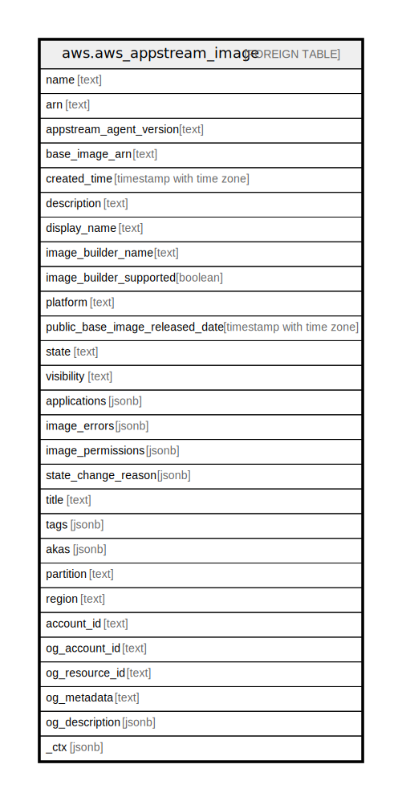

# aws.aws_appstream_image

## Description

AWS AppStream Image

## Columns

| Name | Type | Default | Nullable | Children | Parents | Comment |
| ---- | ---- | ------- | -------- | -------- | ------- | ------- |
| name | text |  | true |  |  | The name of the image. |
| arn | text |  | true |  |  | The Amazon Resource Name (ARN) of the image. |
| appstream_agent_version | text |  | true |  |  | The version of the AppStream 2.0 agent to use for instances that are launched from this image. |
| base_image_arn | text |  | true |  |  | The ARN of the image from which this image was created. |
| created_time | timestamp with time zone |  | true |  |  | The time the image was created. |
| description | text |  | true |  |  | The description to display. |
| display_name | text |  | true |  |  | The image name to display. |
| image_builder_name | text |  | true |  |  | The name of the image builder that was used to create the private image. If the image is shared, this value is null. |
| image_builder_supported | boolean |  | true |  |  | Indicates whether an image builder can be launched from this image. |
| platform | text |  | true |  |  | The operating system platform of the image. |
| public_base_image_released_date | timestamp with time zone |  | true |  |  | The release date of the public base image. For private images, this date is the release date of the base image from which the image was created. |
| state | text |  | true |  |  | The image starts in the PENDING state. If image creation succeeds, the state is AVAILABLE. If image creation fails, the state is FAILED. |
| visibility | text |  | true |  |  | Indicates whether the image is public or private. |
| applications | jsonb |  | true |  |  | The applications associated with the image. |
| image_errors | jsonb |  | true |  |  | Describes the errors that are returned when a new image can't be created. |
| image_permissions | jsonb |  | true |  |  | The permissions to provide to the destination AWS account for the specified image. |
| state_change_reason | jsonb |  | true |  |  | The reason why the last state change occurred. |
| title | text |  | true |  |  | Title of the resource. |
| tags | jsonb |  | true |  |  | A map of tags for the resource. |
| akas | jsonb |  | true |  |  | Array of globally unique identifier strings (also known as) for the resource. |
| partition | text |  | true |  |  | The AWS partition in which the resource is located (aws, aws-cn, or aws-us-gov). |
| region | text |  | true |  |  | The AWS Region in which the resource is located. |
| account_id | text |  | true |  |  | The AWS Account ID in which the resource is located. |
| og_account_id | text |  | true |  |  | The Platform Account ID in which the resource is located. |
| og_resource_id | text |  | true |  |  | The unique ID of the resource in opengovernance. |
| og_metadata | text |  | true |  |  | Platform Metadata of the AWS resource. |
| og_description | jsonb |  | true |  |  | The full model description of the resource |
| _ctx | jsonb |  | true |  |  | Steampipe context in JSON form, e.g. connection_name. |

## Relations

---

> Generated by [tbls](https://github.com/k1LoW/tbls)
