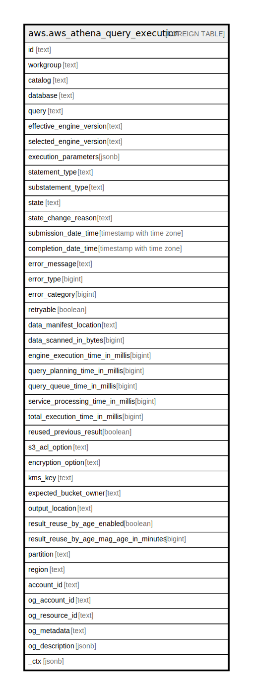

# aws.aws_athena_query_execution

## Description

AWS Athena Query Execution

## Columns

| Name | Type | Default | Nullable | Children | Parents | Comment |
| ---- | ---- | ------- | -------- | -------- | ------- | ------- |
| id | text |  | true |  |  | The unique identifier for each query execution. |
| workgroup | text |  | true |  |  | The name of the workgroup in which the query ran. |
| catalog | text |  | true |  |  | The name of the data catalog used in the query execution. |
| database | text |  | true |  |  | The name of the data database used in the query execution. |
| query | text |  | true |  |  | The SQL query statements which the query execution ran. |
| effective_engine_version | text |  | true |  |  | The engine version on which the query runs. |
| selected_engine_version | text |  | true |  |  | The engine version requested by the users. |
| execution_parameters | jsonb |  | true |  |  | A list of values for the parameters in a query. |
| statement_type | text |  | true |  |  | The type of query statement that was run. |
| substatement_type | text |  | true |  |  | The kind of query statement that was run. |
| state | text |  | true |  |  | The state of query execution. |
| state_change_reason | text |  | true |  |  | Further detail about the status of the query. |
| submission_date_time | timestamp with time zone |  | true |  |  | The date and time that the query was submitted. |
| completion_date_time | timestamp with time zone |  | true |  |  | The date and time that the query completed. |
| error_message | text |  | true |  |  | Contains a short description of the error that occurred. |
| error_type | bigint |  | true |  |  | An integer value that provides specific information about an Athena query error. |
| error_category | bigint |  | true |  |  | An integer value that specifies the category of a query failure error. |
| retryable | boolean |  | true |  |  | True if the query might succeed if resubmitted. |
| data_manifest_location | text |  | true |  |  | The location and file name of a data manifest file. |
| data_scanned_in_bytes | bigint |  | true |  |  | The number of bytes in the data that was queried. |
| engine_execution_time_in_millis | bigint |  | true |  |  | The number of milliseconds that the query took to execute. |
| query_planning_time_in_millis | bigint |  | true |  |  | The number of milliseconds that Athena took to plan the query processing flow. |
| query_queue_time_in_millis | bigint |  | true |  |  | The number of milliseconds that the query was in your query queue waiting for resources. |
| service_processing_time_in_millis | bigint |  | true |  |  | The number of milliseconds that Athena took to finalize and publish the query results after the query engine finished running the query. |
| total_execution_time_in_millis | bigint |  | true |  |  | The number of milliseconds that Athena took to run the query. |
| reused_previous_result | boolean |  | true |  |  | True if a previous query result was reused; false if the result was generated. |
| s3_acl_option | text |  | true |  |  | The Amazon S3 canned ACL that Athena should specify when storing query results. |
| encryption_option | text |  | true |  |  | Indicates whether Amazon S3 server-side encryption with Amazon S3-managed keys (SSE_S3), server-side encryption with KMS-managed keys (SSE_KMS), or client-side encryption with KMS-managed keys (CSE_KMS) is used. |
| kms_key | text |  | true |  |  | For SSE_KMS and CSE_KMS, this is the KMS key ARN or ID. |
| expected_bucket_owner | text |  | true |  |  | The Amazon Web Services account ID that you expect to be the owner of the Amazon S3 bucket specified by ResultConfiguration$OutputLocation. |
| output_location | text |  | true |  |  | The location in Amazon S3 where your query results are stored. |
| result_reuse_by_age_enabled | boolean |  | true |  |  | True if previous query results can be reused when the query is run. |
| result_reuse_by_age_mag_age_in_minutes | bigint |  | true |  |  | Specifies, in minutes, the maximum age of a previous query result that Athena should consider for reuse. The default is 60. |
| partition | text |  | true |  |  | The AWS partition in which the resource is located (aws, aws-cn, or aws-us-gov). |
| region | text |  | true |  |  | The AWS Region in which the resource is located. |
| account_id | text |  | true |  |  | The AWS Account ID in which the resource is located. |
| og_account_id | text |  | true |  |  | The Platform Account ID in which the resource is located. |
| og_resource_id | text |  | true |  |  | The unique ID of the resource in opengovernance. |
| og_metadata | text |  | true |  |  | Platform Metadata of the AWS resource. |
| og_description | jsonb |  | true |  |  | The full model description of the resource |
| _ctx | jsonb |  | true |  |  | Steampipe context in JSON form, e.g. connection_name. |

## Relations

---

> Generated by [tbls](https://github.com/k1LoW/tbls)
